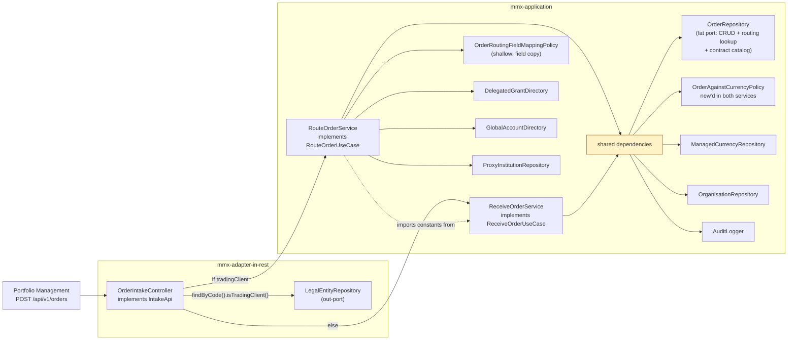
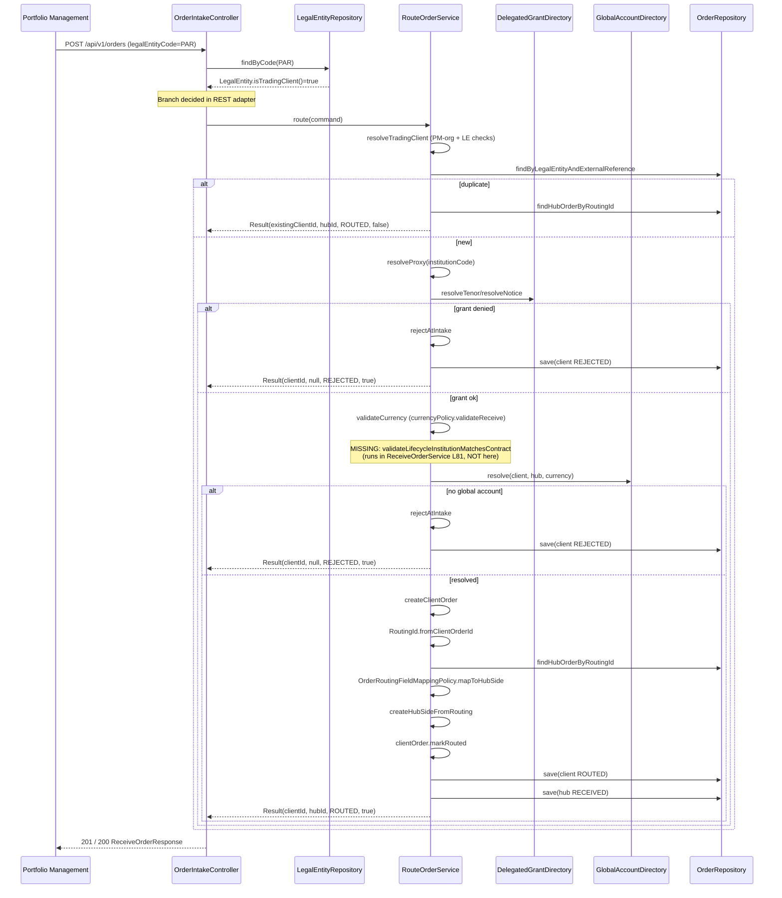
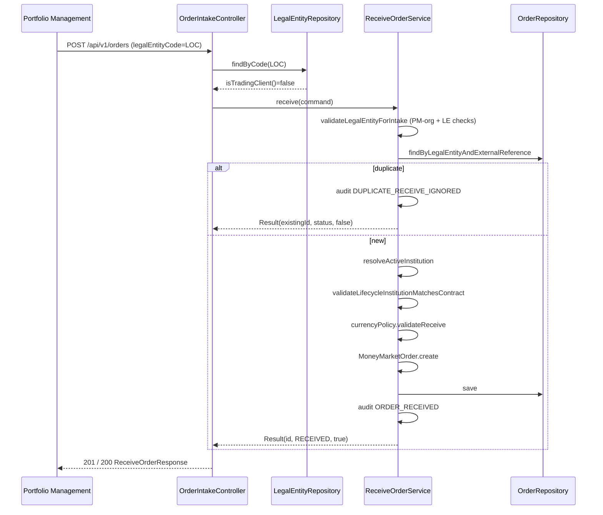
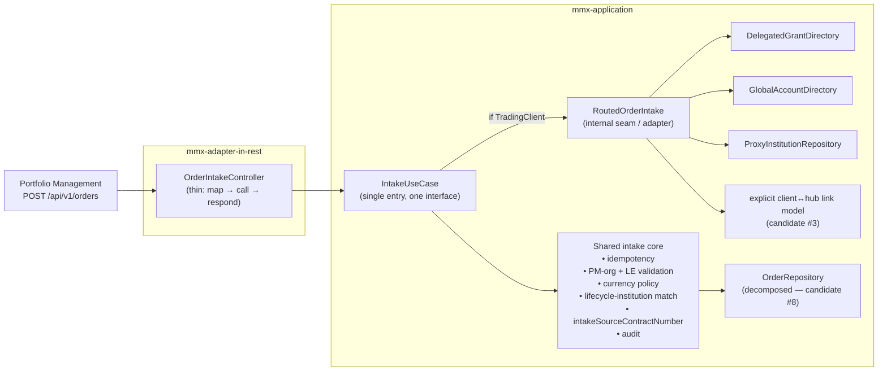
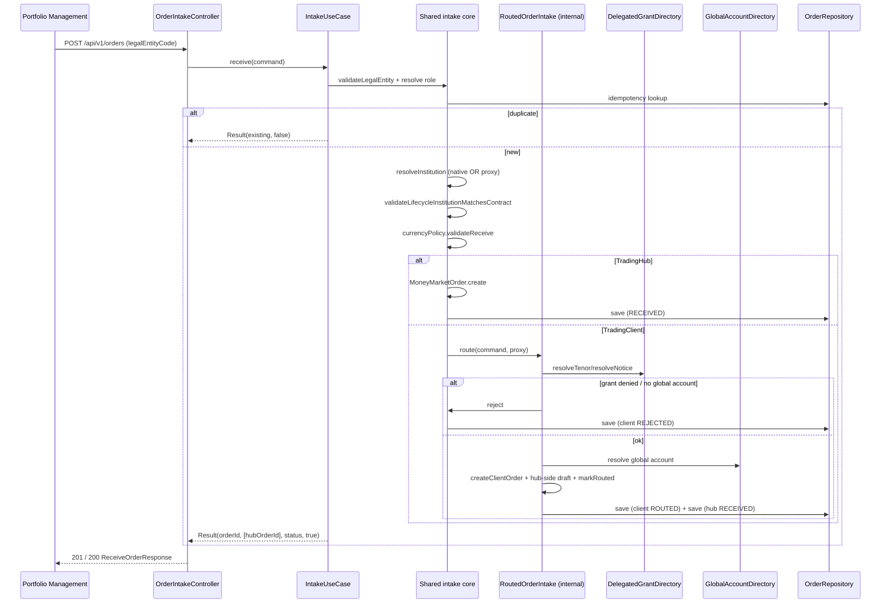

# Point 1 — Unified order intake: current vs target architecture

Scoped architecture visualization for deepening opportunity #1 from [PRD.md](./PRD.md).
Generated with the `mermaid-diagrams` and `architecture-blueprint-generator` skills, scoped to the **order intake / routing** area (not the whole project).

Vocabulary: domain from [CONTEXT.md](../../CONTEXT.md); architecture (Module, Interface, Depth, Seam, Adapter, Leverage, Locality) from the `improve-codebase-architecture` skill.

---

## 1. Current architecture — module map

The intake seam is smeared across three modules. The REST adapter owns the TradingClient vs TradingHub branch; two application services re-implement near-identical intake; routing correlation lives on nullable columns.

### What's shallow / smeared here

| Module | Shape | Deletion-test verdict |
|--------|-------|----------------------|
| `OrderIntakeController.receiveOrder` (39–66) | Owns the TradingClient vs TradingHub **decision** and reaches into `LegalEntityRepository` to make it; drops `hubOrderId` from the routed result | Moving the branch into application **concentrates**; deleting it without a replacement **moves** logic to callers |
| `RouteOrderService` (40–260) | Re-implements ~70% of `ReceiveOrderService`: idempotency, `intakeSourceContractNumber` (254–259 ≡ 179–184), currency validation wiring (184–198 ≡ 83–97), PM-org legal-entity checks (220–242 ≡ 122–138), audit constants (42–45 imported from `ReceiveOrderService`) | Folding the two together **concentrates**; deleting one without merging **moves** the duplicated validation |
| `OrderRoutingFieldMappingPolicy` | Field copy, no rules — a pass-through | Deleting it **moves** (inline into `RouteOrderService`) |
| `OrderRepository` | One port for CRUD + routing lookup + contract catalog | Splitting **concentrates** each seam (candidate #8) |

---

## 2. Current architecture — routed intake sequence (TradingClient)

### The real gap

`ReceiveOrderService.receive` calls `validateLifecycleInstitutionMatchesContract` (L81) for OnCall INCREASE/DECREASE/REDEMPTION — it checks the submitted `institutionCode` matches the source contract's institution. `RouteOrderService.route` **never calls it**. A TradingClient placing an OnCall lifecycle operation on a delegated institution can submit a mismatched institution code and pass intake, because the routing path only validates the **grant**, not the **contract match**.

---

## 3. Current architecture — hub-native intake sequence (TradingHub)

### Duplicated work between the two sequences

- PM-org + LegalEntity validation: `ReceiveOrderService.validateLegalEntityForIntake` (122–138) vs `RouteOrderService.resolveTradingClient` (220–242).
- Currency validation: `ReceiveOrderService` L83–97 vs `RouteOrderService.validateCurrency` L184–198.
- `intakeSourceContractNumber`: `ReceiveOrderService` L179–184 vs `RouteOrderService` L254–259 (identical).
- Idempotency lookup: both call `findByLegalEntityAndExternalReference` first.
- Audit constants: `RouteOrderService` imports `AUDIT_ACTOR_SYSTEM` and `EVENT_DUPLICATE_RECEIVE_IGNORED` from `ReceiveOrderService` (L42, L45).

---

## 4. Target architecture — module map

One application entry owns intake for both hub-native and routed orders. The TradingClient branch becomes an **internal seam** behind the same interface. The REST adapter no longer decides routing and no longer reaches into `LegalEntityRepository`.

### What "deep" means here

- **One interface** (`IntakeUseCase`) replaces two use-cases. The REST controller stops branching and stops injecting `LegalEntityRepository`.
- **Shared intake core** holds every rule that today is duplicated — so the missing `validateLifecycleInstitutionMatchesContract` is fixed **once** and applies to both paths.
- **`RoutedOrderIntake` is an internal seam**, not an external one: it adds grant resolution + proxy institution + global account + hub-side order creation behind the common core. Per LANGUAGE.md this is an *internal seam* private to the intake module's implementation; the *external seam* stays single.
- **Leverage**: one test surface covers both paths. **Locality**: intake rules change in one place.

---

## 5. Target architecture — single intake sequence

### What changed vs current

- No `LegalEntityRepository` call in the controller.
- `validateLifecycleInstitutionMatchesContract` runs on **both** paths (gap closed).
- One idempotency lookup, one audit path, one `intakeSourceContractNumber`.
- Hub-side order creation stays behind the internal `RoutedOrderIntake` seam — the external interface is single.

---

## 6. Current → target diff

| Concern | Current | Target |
|---------|---------|--------|
| Routing decision | `OrderIntakeController` branches on `isTradingClient()` | Internal to `IntakeUseCase` |
| `LegalEntityRepository` in REST | Yes (controller injects it) | No |
| Application entry points | `ReceiveOrderUseCase` + `RouteOrderUseCase` | `IntakeUseCase` (one) |
| PM-org + LE validation | Duplicated (122–138 / 220–242) | Shared intake core |
| Currency validation | Duplicated (83–97 / 184–198) | Shared intake core |
| `intakeSourceContractNumber` | Duplicated (179–184 / 254–259) | Shared intake core |
| Lifecycle-institution match | Hub path only (L81) | Both paths (gap closed) |
| Audit constants | `RouteOrderService` imports from `ReceiveOrderService` | One module |
| Hub-side order creation | `RouteOrderService` + `OrderRoutingFieldMappingPolicy` | `RoutedOrderIntake` internal seam |
| Test surface | Two parallel service tests; routing path uncovered for several invariants | One intake test surface; both paths probe the same seam |

---

## 7. Grilling decisions (resolved 2026-07-05)

The grilling loop walked the design tree and resolved every load-bearing decision. Each is recorded with its rationale; the OpenSpec change (`/opsx:propose`) will encode them in `design.md` and `tasks.md`.

| # | Decision | Rationale |
|---|----------|-----------|
| 1 | **One unified `IntakeUseCase`** replaces `ReceiveOrderUseCase` + `RouteOrderUseCase`. `RoutedOrderIntake` is an internal collaborator, not a public port. | The two current use-cases are not real seams (one impl each, 70% shared logic; "one adapter = hypothetical seam"). Forces the routing decision into application; makes REST genuinely thin; one test surface. Contract unchanged. |
| 2 | **Fix the spec-violation gap first** via TDD red-green on the current `RouteOrderUseCase`, then behavior-preserving refactor to `IntakeUseCase`. | AGENTS.md defaults bug fixes to strict TDD. Fix-first keeps the bug fix small/attributable and the refactor reviewable as a no-behavior-change step. |
| 3 | **One `TransactionalIntakeUseCase` wrapper** in `mmx-bootstrap`, delegates to `IntakeService`. | Matches the existing `Transactional*UseCase` pattern; keeps `@Transactional` out of `mmx-application`; gives the routed two-record write one atomic transaction (ADR-0002); retires the "inconsistent wrappers" smaller item (Receive had none). |
| 4 | **`RoutedOrderIntake` as a concrete class** (no port interface), `@Bean`-wired in `OrderModuleConfiguration`, injected into `IntakeService`. | Composition, not a seam — doesn't violate "don't introduce a seam unless something varies." Groups routing-specific ports; keeps `IntakeService` focused on the shared core. Two-adapter trigger not met. |
| 5 | **Fold `mapToHubSide` into `RoutedOrderIntake`** as a private method; **delete `OrderRoutingFieldMappingPolicy`**; keep `RoutedHubOrderDraft` in `mmx-domain` (domain factory input). | The policy is a pure field-copy with no rules — the spec'd decisions live in the caller. Removes a shallow pass-through; the spec anchor is a test on `RoutedOrderIntake`, not a class name. |
| 6 | **Keep point 1 minimal** — do not fold in candidate #3 (link model) or #8 (`OrderRepository` decomposition). | Each candidate is its own OpenSpec change with its own design tree; folding mingles refactors. The unification works on today's correlation mechanism unchanged. Surgical changes (Karpathy / AGENTS.md). |
| 7 | **`IntakeUseCase.Result(UUID orderId, OrderStatus status, boolean newlyCreated)`** — drop `hubOrderId` entirely. | `hubOrderId` is dead today (controller drops it, contract has no field, audit doesn't log it); the hub id is re-derivable via `findHubOrderByRoutingId`. YAGNI. Result maps 1:1 to `ReceiveOrderResponse`. |
| 8 | **Validation ordering on the routed path:** institution-constraint checks first (`resolveProxy` → `validateLifecycleInstitutionMatchesContract` → `currencyPolicy`) which **throw `InvalidOrderException` and create no order**; then routing-failure checks (`resolveGrant` → `resolveGlobalAccount`) which **`rejectAtIntake` and create a client `REJECTED` order**. | Spec distinguishes the two failure classes: `order-institution-constraints` L99 ("no order SHALL be created") vs `order-routing` L47/L52 ("client-side order is `REJECTED`"). The gap fix is an institution-constraint violation, so it throws and creates no order — matching the hub path. |

### Spec findings established during grilling

- **The lifecycle-institution-match gap is a spec violation**, not a smell: `order-institution-constraints` L97–115 is unconditional and L51 explicitly binds TradingClient intake; `RouteOrderService` never calls `validateLifecycleInstitutionMatchesContract`. Bug fix; no spec change needed, just code conformance.
- **`hubOrderId` is not in the contract**: `contracts/001.../openapi.yaml` `ReceiveOrderResponse` requires `[orderId, status, legalEntityCode]`. The controller dropping it is correct; we do not surface it (that would be a contract change requiring SDD).
- **ContractNumbers are globally unique** (`UuidReferenceGenerator` → `"CN-" + UUID`), so the unscoped `findExecutedSubscriptionByContractNumber` is not a correctness bug today; the proxy-vs-proxy match on the routed path works. Scoping the lookup by `legalEntityCode` is a defense-in-depth smaller item, **out of scope** for point 1.

### Behavior preserved (no change during refactor)

- Routed idempotency duplicate: returns `Result(existingClientId, existingStatus, false)` (without `hubOrderId` now).
- `rejectAtIntake` for grant/global-account failures: client `REJECTED` order created, no hub-side order (spec'd).
- Routing correlation via `routingId` + `findHubOrderByRoutingId` + `markRouted`: unchanged (candidate #3 deferred).
- `OrderRepository` fat port: unchanged (candidate #8 deferred).
- Domain factories `MoneyMarketOrder.create` / `createHubSideFromRouting`: unchanged.
- Audit events: `ORDER_RECEIVED` (hub path), `ORDER_ROUTED` / `ORDER_ROUTING_REJECTED` (routed path), `DUPLICATE_RECEIVE_IGNORED` (both) — unchanged.

### ADR / CONTEXT

- **No CONTEXT.md update.** No new domain term was resolved; `IntakeUseCase` / `RoutedOrderIntake` / `TransactionalIntakeUseCase` are implementation, not ubiquitous language. The institution-constraint-vs-routing-failure distinction is already covered across `order-institution-constraints` and `order-routing` specs.
- **ADR not created now.** Decision #1 is a real trade-off (considered two-facade option) and moderately hard to reverse; a future `/improve-codebase-architecture` pass might re-suggest splitting. But it's an application-layer module-shape decision, narrower than the existing ADRs (deployment / record model / ownership / identity). Capture in the OpenSpec change's `design.md`; elevate to ADR-0005 only if it still feels load-bearing after implementation.

### Migration plan (high level — to be refined by `/opsx:propose`)

1. **Red**: write a failing test against `RouteOrderUseCase` — routed OnCall INCREASE with mismatched `institutionCode` is accepted today (should throw `InvalidOrderException`, no order created). `mvn test -pl mmx-application -Dtest=RouteOrderServiceTest`.
2. **Green**: add `validateLifecycleInstitutionMatchesContract` to `RouteOrderService` after `resolveProxy`, before `resolveGrant`. Re-run the same `-Dtest`.
3. **Refactor (behavior-preserving)**: introduce `IntakeUseCase` + `IntakeService` + `RoutedOrderIntake`; fold `mapToHubSide`; delete `OrderRoutingFieldMappingPolicy`; add `TransactionalIntakeUseCase`; thin `OrderIntakeController` (drop `LegalEntityRepository`, drop the branch); rewire `OrderModuleConfiguration`; migrate tests to `IntakeUseCase`. ArchUnit `HexagonalArchitectureTest` must stay green.
4. **Final verification**: full reactor `mvn test` from `backend/` (including `mmx-bootstrap` integration tests) once the refactor is green.
