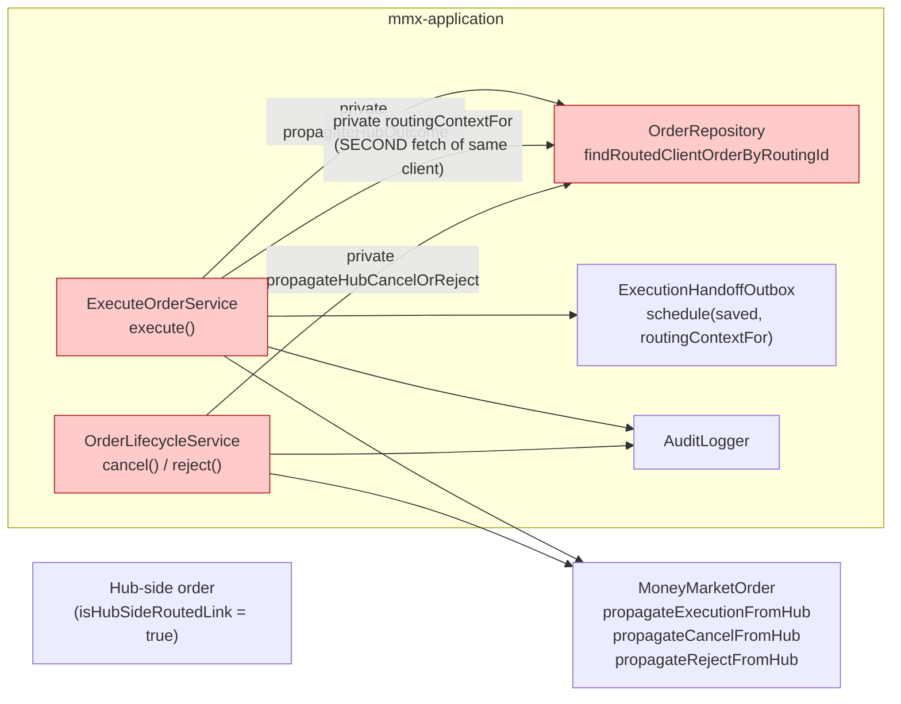
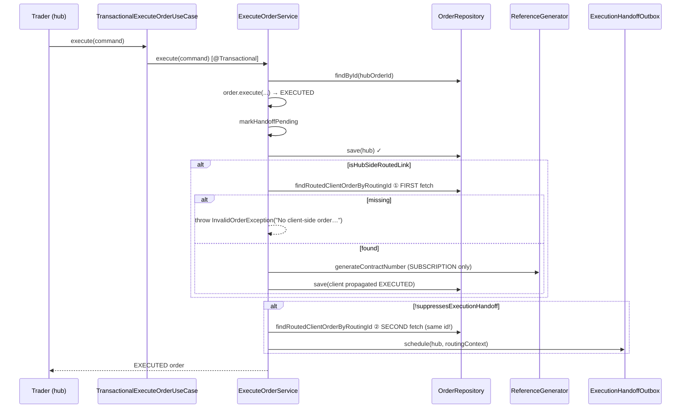
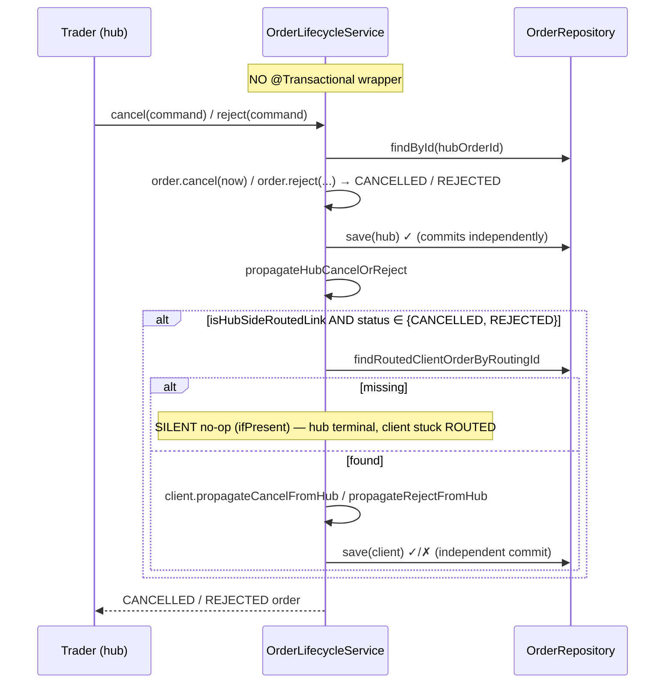
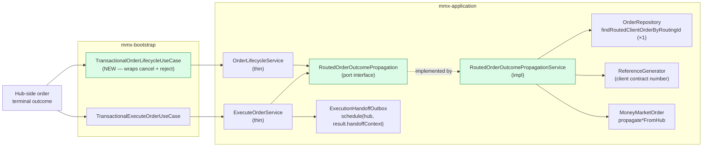
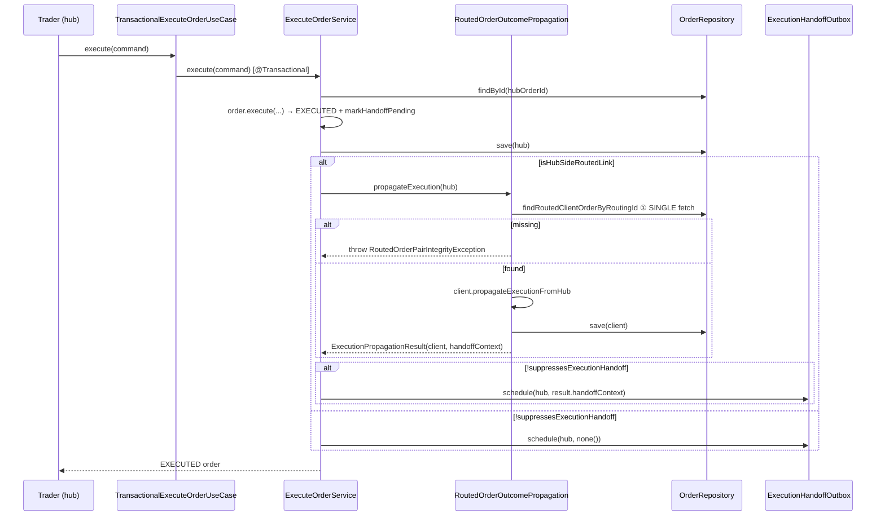
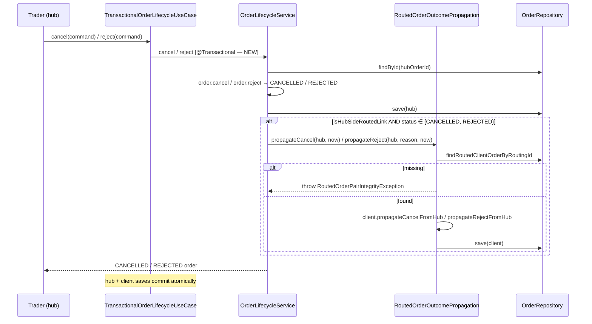

# Point 2 — Routed-order pair outcome-propagation: current vs target architecture

Scoped architecture visualization for deepening opportunity #2 from [PRD.md](./PRD.md).
Scoped to the **hub→client terminal outcome propagation** area (execute / cancel / reject), not the whole project.

Vocabulary: domain from [CONTEXT.md](../../CONTEXT.md) ("Routing outcome propagation", L123–124); architecture (Module, Interface, Depth, Seam, Adapter, Leverage, Locality) from the `improve-codebase-architecture` skill. Invariant source: [ADR-0002](../../docs/adr/0002-routed-order-is-two-linked-records.md).

---

## 1. Current architecture — module map

Hub→client outcome propagation is smeared across two application services with the same guard, the same client lookup, and the same apply-outcome shape. The execute path fetches the client-side order **twice**; the cancel/reject path has **zero unit tests** and silently no-ops on a missing client.

### What's shallow / smeared here

| Module | Shape | Deletion-test verdict |
|--------|-------|----------------------|
| `ExecuteOrderService.propagateHubOutcome` + `routingContextFor` (91–130) | Guard `isHubSideRoutedLink`; lookup `findRoutedClientOrderByRoutingId`; apply `propagateExecutionFromHub`; persist. **Plus** a second lookup in `routingContextFor` for the outbox context — same client fetched twice. | Extracting concentrates; deleting either private method moves logic to the other service. |
| `OrderLifecycleService.propagateHubCancelOrReject` (62–81) | Same guard, same lookup, `propagateCancelFromHub` / `propagateRejectFromHub`, persist. **Silently `ifPresent` no-ops on missing client** (vs execute which throws). **Zero unit tests** (`OrderLifecycleServiceTest` uses only hub-native orders). | Extracting concentrates; deleting it moves logic into `ExecuteOrderService`-style duplication. |
| `OrderRepository.findRoutedClientOrderByRoutingId` | The shared lookup seam — correct, but called twice per execute. | Splitting the port is candidate #8 (deferred). |

### The real gaps

1. **Untested cancel/reject propagation.** `propagateCancelFromHub` / `propagateRejectFromHub` exist on `MoneyMarketOrder` and are **never exercised by any test**. ADR-0002 mandates "terminal outcomes propagate" — this half of the invariant has no automated guard.
2. **Silent desync on broken pair.** A hub cancel/reject where the client-side order is missing (a corrupt pair — itself an ADR-0002 violation) **silently completes**: hub `Cancelled`/`Rejected`, client stuck `Routed` forever. Execute throws `InvalidOrderException` in the same situation — asymmetric and invisible to ops.
3. **No transaction boundary on cancel/reject.** `ExecuteOrderService` runs inside `TransactionalExecuteOrderUseCase` (hub-save + propagation + outbox atomic). `OrderLifecycleService` has **no wrapper** — hub `save` and client `save` can commit independently, so even a non-missing client can desync on a failed client save.

---

## 2. Current architecture — hub execute sequence (routed)

---

## 3. Current architecture — hub cancel / reject sequence (routed)

### Duplicated skeleton between the two sequences

| Step | Execute | Cancel/Reject |
|------|---------|---------------|
| Guard | `isHubSideRoutedLink()` | `isHubSideRoutedLink()` + status ∈ {CANCELLED, REJECTED} |
| Lookup | `findRoutedClientOrderByRoutingId` (×2) | same (×1) |
| Apply | `propagateExecutionFromHub` | `propagateRejectFromHub` / `propagateCancelFromHub` |
| Persist | `orderRepository.save(client)` | same |
| Missing-client policy | **throw** `InvalidOrderException` | **silent no-op** |
| Transaction | `TransactionalExecuteOrderUseCase` | **none** |

---

## 4. Target architecture — module map

One port owns "when a hub-side order reaches a terminal outcome, find the linked client-side order by routing id, apply the outcome, and (for execute) produce the routing context for the outbox." Both services call it; the double-fetch is gone; the broken-pair invariant is enforced uniformly; cancel/reject become atomic with the hub save.

### What "deep" means here

- **One interface** (`RoutedOrderOutcomePropagation`) replaces two private methods. The cancel/reject path finally has a testable seam.
- **Single client fetch on execute**: `propagateExecution` returns `ExecutionPropagationResult(clientOrder, handoffContext)` — the outbox context is a byproduct of propagation, not a second lookup.
- **Uniform invariant enforcement**: a missing client-side order throws `RoutedOrderPairIntegrityException` on **all three** outcomes — the silent desync on cancel/reject is gone.
- **Atomic terminal sync**: `TransactionalOrderLifecycleUseCase` makes hub-save + client-propagation one transaction on cancel/reject, matching execute's existing atomicity (ADR-0002).
- **Leverage**: one test surface (`RoutedOrderOutcomePropagationServiceTest`) asserts the pair-sync invariant across execute/cancel/reject — including the cases that today have zero tests. **Locality**: the routing-outcome rules sit in one place.

---

## 5. Target architecture — hub execute sequence (routed)

### What changed vs current

- One `findRoutedClientOrderByRoutingId` call (was two).
- Missing client throws `RoutedOrderPairIntegrityException` (was `InvalidOrderException` — semantically wrong for an invariant violation).
- `routingContextFor` private method **deleted**; the outbox context comes from the propagation result.

---

## 6. Target architecture — hub cancel / reject sequence (routed)

### What changed vs current

- `@Transactional` boundary added (`TransactionalOrderLifecycleUseCase`) — hub and client terminal transitions commit together (ADR-0002).
- Missing client throws `RoutedOrderPairIntegrityException` (was silent no-op). **Behavior change** — only triggers in a state that already violates ADR-0002; surfacing it is the fix.
- Propagation logic moved behind the port; `OrderLifecycleService` becomes a thin caller.

---

## 7. Current → target diff

| Concern | Current | Target |
|---------|---------|--------|
| Propagation logic | Two private methods (`propagateHubOutcome`, `propagateHubCancelOrReject`) | One port `RoutedOrderOutcomePropagation` + impl |
| Client lookup on execute | `findRoutedClientOrderByRoutingId` **×2** | **×1** (context derived from propagation result) |
| `routingContextFor` | Private method in `ExecuteOrderService` | **Deleted** — `ExecutionPropagationResult.handoffContext` |
| Missing-client policy | Execute throws `InvalidOrderException`; cancel/reject **silent no-op** | All three throw `RoutedOrderPairIntegrityException` (uniform) |
| Cancel/reject transaction | **None** (hub + client saves independent) | `TransactionalOrderLifecycleUseCase` — atomic (ADR-0002) |
| Cancel/reject test surface | **Zero unit tests** | `RoutedOrderOutcomePropagationServiceTest` covers all three outcomes |
| Caller shape | `ExecuteOrderService` / `OrderLifecycleService` own propagation | Both inject the port; thin callers |
| `OrderRepository` fat port | Unchanged | Unchanged (candidate #8 deferred) |
| Routing correlation model | `routingId` + `isHubSideRoutedLink` nullable sentinel | Unchanged (candidate #3 deferred) |

---

## 8. Grilling decisions (resolved 2026-07-07)

The grilling loop walked the design tree and resolved every load-bearing decision. Each is recorded with its rationale; the OpenSpec change (`/opsx:propose`) will encode them in `design.md` and `tasks.md`.

| # | Decision | Rationale |
|---|----------|-----------|
| 1 | **Port interface** `RoutedOrderOutcomePropagation` in `mmx-application`, single impl, mocked in tests. | Two real callers (`ExecuteOrderService`, `OrderLifecycleService`) — the "hypothetical seam" objection that made #1's `RoutedOrderIntake` a concrete class doesn't apply. The untested cancel/reject path is the *point* of the change; a port gives it a testable seam, matching the `OrderRepository` mock pattern. |
| 2 | **Port owns propagation + the `ExecutionHandoffRoutingContext`** for execute. `propagateExecution` returns `ExecutionPropagationResult(clientOrder, handoffContext)`; cancel/reject are `void`. | Kills the double-fetch on hub execute (today `findRoutedClientOrderByRoutingId` runs twice). The port already holds the client order after propagation, so deriving the context is free. Coherent contract: "apply the terminal outcome; for execute, also return what the outbox needs." Outbox scheduling stays in `ExecuteOrderService` (port doesn't touch messaging). |
| 3 | **Throw a distinct `RoutedOrderPairIntegrityException`** on all three outcomes when the client-side order is missing. New exception in `mmx-domain` (invariant violation, not user input). | Closes the latent desync: today hub cancel/reject silently no-op on a missing client → hub `Cancelled`, client stuck `Routed` forever. ADR-0002 makes the pair an invariant; a broken pair is data corruption, not "nothing to update." Distinct exception keeps `InvalidOrderException` for user-input errors and is ops-alertable. **Behavior change on cancel/reject** — to flag in the proposal. |
| 4 | **Client-side contract-number rule moves as-is** into the propagation impl (subscription → new, lifecycle → reuse client's `sourceContractNumber`). `resolveExecutionContractNumber` stays in `ExecuteOrderService`. | Surgical scope (#1 decision #6 / Karpathy). The two rules share a *shape* but operate on different orders/sources — not pure duplicates; #4 designs the right "per `(operation, side, stage)`" abstraction. The two-numbers invariant is still assertable via the port's `ExecutionPropagationResult`. |
| 5 | **`TransactionalOrderLifecycleUseCase`** (one wrapper for both cancel and reject) in `mmx-bootstrap`, mirroring `TransactionalExecuteOrderUseCase`. | Closes the cancel/reject atomicity gap — without it, Decision 3 only catches *missing* clients, not *failed client saves*. One wrapper matches `OrderLifecycleService`'s own shape (it implements both use-cases). Retires the "inconsistent wrappers" smaller PRD item alongside #1's `TransactionalIntakeUseCase`. `@Transactional` stays out of `mmx-application`. |
| 6 | **Migration: lock current behavior → extract port (behavior-preserving) → flip error policy → add tx wrapper.** | Matches #1's decision #2 and AGENTS.md TDD. Locking the current silent-skip on cancel/reject first proves the extraction is behavior-preserving; the behavior change (Decision 3) is the riskiest, trader-visible part and gets its own attributable red→green step. |
| 7 | **Name: `RoutedOrderOutcomePropagation` (port) + `RoutedOrderOutcomePropagationService` (impl) + `ExecutionPropagationResult`** (return record), all in `com.mmx.order.application.service`. | "Routing outcome propagation" is the CONTEXT ubiquitous-language *concept*; the module names the *entity* it operates on (a routed order). Drops redundant "Pair." `...Service` suffix matches every neighbor in that package. ArchUnit confirms an interface in the service package is clean (Application→Application+Domain; `RoutedOrderIntake` already lives there from #1). |
| 8 | **No CONTEXT.md update; no new ADR now.** Capture all decisions in the OpenSpec change's `design.md`, referencing ADR-0002 as the invariant source. Elevate to ADR-0005 only if a decision still feels load-bearing after implementation. | "Routing outcome propagation" is already in CONTEXT (L123–124); module/exception/wrapper names are implementation. The pair-existence invariant is already in ADR-0002; the throw-vs-skip enforcement policy is easily reversible in code (weak on the ADR "hard to reverse" prong). Matches #1's decisions #7 and #8. |

### Findings established during grilling (non-decisions)

- **Idempotency of propagation is a non-issue.** Hub-side `cancel()` / `reject()` / `execute()` all throw on already-terminal via `status.transitionTo(...)`, so propagation runs at most once per hub terminal transition. No idempotency logic needed in the port.
- **`Accounted` is out of scope — settled by CONTEXT L121/L127.** Reached independently per side via separate back-office callbacks; not a desk outcome. The port covers execute/cancel/reject only — recorded as an explicit scope boundary.
- **Cancel/reject propagation has zero unit tests today** (`OrderLifecycleServiceTest` uses only hub-native orders with no `routingId`). Domain methods `propagateCancelFromHub` / `propagateRejectFromHub` exist on `MoneyMarketOrder` and are never exercised. This is the core leverage the change buys.

### Behavior changes to flag in the proposal

1. Hub cancel/reject on a corrupted pair (missing client-side order) now **throws `RoutedOrderPairIntegrityException`** instead of silently completing. Only triggers in a state that already violates ADR-0002; surfacing it is the fix, not a regression.
2. Hub execute no longer fetches the client-side order twice (single fetch inside the port).

### Behavior preserved (no change during refactor step)

- Execute propagation contract-number rule (subscription → new client number; lifecycle → reuse client source).
- `suppressesExecutionHandoff` logic and the routed-client-side "no outbox row" exception.
- Routing correlation via `routingId` + `findRoutedClientOrderByRoutingId` (candidate #3 deferred).
- `OrderRepository` fat port (candidate #8 deferred).
- Audit events (`ORDER_EXECUTED`, `ORDER_CANCELLED`, `ORDER_REJECTED`) — unchanged.
- Domain methods `propagateExecutionFromHub` / `propagateCancelFromHub` / `propagateRejectFromHub` — unchanged.

### ADR / CONTEXT

- **No CONTEXT.md update.** No new domain term resolved; `RoutedOrderOutcomePropagation` / `RoutedOrderPairIntegrityException` / `TransactionalOrderLifecycleUseCase` are implementation. The "Routing outcome propagation" concept and the per-side `Accounted` rule are already in CONTEXT L123–127.
- **No new ADR now.** The pair-existence invariant and "terminal outcomes propagate" are already in ADR-0002. The throw-on-missing enforcement and the tx wrapper are easily reversible in code (weak on the ADR "hard to reverse" prong). Capture in `design.md`; elevate to ADR-0005 only if still load-bearing after implementation.

### Migration plan (high level — to be refined by `/opsx:propose`)

1. **Red (lock current behavior):** tests asserting today's `ExecuteOrderService.propagateHubOutcome` (execute → client propagated, two-numbers) and `OrderLifecycleService.propagateHubCancelOrReject` (cancel/reject → client propagated, *silent-skip on missing client*). `mvn test -pl mmx-application -Dtest=ExecuteOrderServiceTest` + `-Dtest=OrderLifecycleServiceTest`.
2. **Green (confirm against today's code):** these pass as-is.
3. **Refactor (behavior-preserving):** extract `RoutedOrderOutcomePropagation` port + `RoutedOrderOutcomePropagationService` impl; `propagateHubOutcome` + `routingContextFor` → `propagateExecution` returning `ExecutionPropagationResult`; `propagateHubCancelOrReject` → `propagateCancel` / `propagateReject`; `ExecuteOrderService` and `OrderLifecycleService` inject the port and become thin. ArchUnit `HexagonalArchitectureTest` stays green.
4. **Red (behavior change):** update the cancel/reject missing-client tests from silent-skip to `RoutedOrderPairIntegrityException`; add execute missing-client throws the same exception (replacing today's `InvalidOrderException`).
5. **Green:** throw `RoutedOrderPairIntegrityException` in the impl on all three outcomes.
6. **Tx wrapper:** add `TransactionalOrderLifecycleUseCase` in `mmx-bootstrap`; rewire `cancelOrderUseCase` / `rejectOrderUseCase` beans; add an atomicity assertion (integration-level or documented in the test) that hub+client saves commit together on cancel/reject.
7. **Final verification:** full reactor `mvn test` from `backend/` (including `mmx-bootstrap` integration tests).
