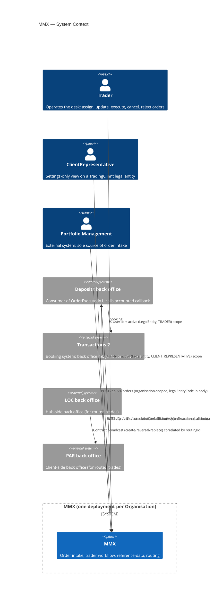
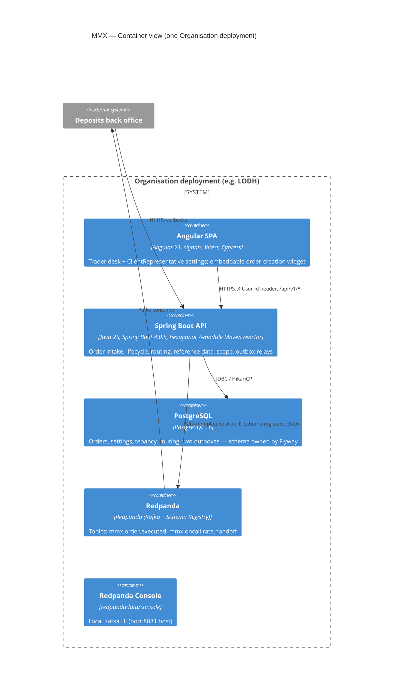
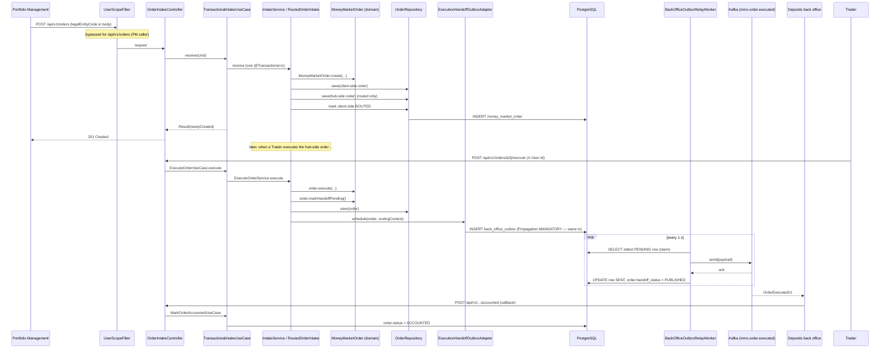
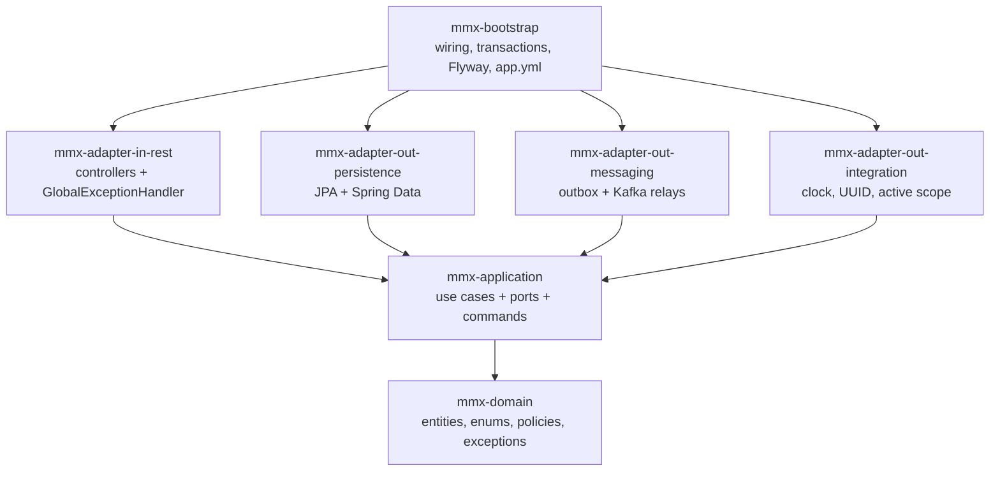
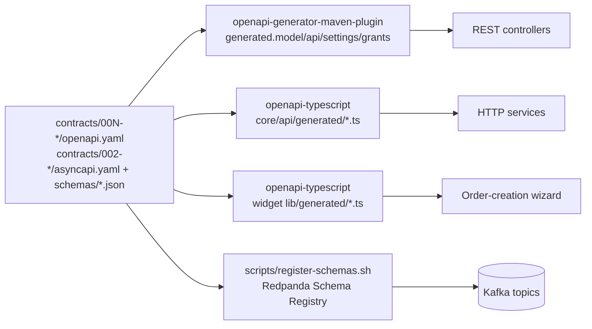
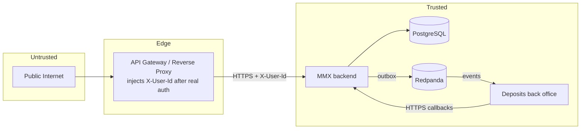

# MMX — Project Architecture Blueprint

> Definitive architectural reference for the **Money Market Exchange (mmx)** system. Maintains architectural consistency for new development. Pair this document with the domain glossary ([`CONTEXT.md`](../CONTEXT.md)) and the code-location index ([`docs/agents/codebase-map.md`](agents/codebase-map.md)).
>
> **Generated:** 2026-07-27 · **Detail level:** Comprehensive · **Diagrams:** C4 (Mermaid) · **Includes:** code examples, implementation patterns, ADRs
>
> Code is cited as `file_path:line` so the reader can jump straight to the source.

---

## 1. Architecture Detection and Analysis

### 1.1 Technology stack detected

| Layer | Technology | Evidence |
|------|------------|----------|
| **Backend language** | Java 25 | `backend/pom.xml:32` (`<java.version>25</java.version>`) |
| **Backend framework** | Spring Boot 4.0.5 (parent POM) | `backend/pom.xml:8-12` |
| **Persistence** | Spring Data JPA + Hibernate (PostgreSQL dialect), Flyway migrations | `application.yml:11-21`; entities under `mmx-adapter-out-persistence/.../entity/` |
| **Database** | PostgreSQL 16 (Testcontainers in tests, H2 in REST slice tests) | `docker-compose.yml:5`; `application-test.yml` |
| **Messaging** | Apache Kafka via Redpanda, Spring Kafka `KafkaTemplate<String,String>`, JSON Schema Registry | `docker-compose.yml:24-52`; `application.yml:22-25` |
| **API codegen (backend)** | OpenAPI Generator 7.14 (`java` + `spring` generators, Bean Validation on) | `backend/mmx-adapter-in-rest/pom.xml:66-68` |
| **Frontend language** | TypeScript 5.9 (strict) | `frontend/package.json:43`; `frontend/tsconfig.json` |
| **Frontend framework** | Angular 21.2 (standalone components, signals, OnPush) | `frontend/package.json:25-30` |
| **Frontend build** | `@angular/build:application` (esbuild), ng-packagr for the widget library | `frontend/angular.json:22,86` |
| **Frontend codegen** | `openapi-typescript` (types only) for contracts 002–006 | `frontend/package.json:6` |
| **Frontend state** | Angular Signals + RxJS Observables (no NgRx, no `BehaviorSubject`) | `frontend/src/app/core/trader/trader-context.service.ts:29-33` |
| **Frontend tests** | Vitest 4 (`ng test`), Cypress 15 (e2e) | `frontend/package.json:44,38` |
| **Backend tests** | JUnit 5, AssertJ, Mockito, Testcontainers, ArchUnit 1.4.2, awaitility, json-schema-validator | `backend/pom.xml:38-41`; `backend/mmx-bootstrap/pom.xml:63-94` |
| **Local infra** | docker-compose: `postgres:16-alpine`, `redpandadata/redpanda`, `redpandadata/console` | `docker-compose.yml` |
| **Auth** | Trusted `X-User-Id` header + server-side active scope (no Spring Security) | `backend/mmx-adapter-in-rest/.../scope/UserScopeFilter.java:21-83` |

### 1.2 Architectural pattern detected

A **hexagonal (ports-and-adapters) modular monolith**, wrapped by an Angular SPA, deployed **one instance per Organisation** with **LegalEntity as the tenant partition** inside the single deployment (ADR-0001). The backend is a strict 7-module Maven reactor where dependencies only point inward (domain ← application ← adapters ← bootstrap); cross-adapter communication is forbidden and enforced by ArchUnit tests (see §10.4). Async integration with the back office uses the **transactional-outbox pattern** over Kafka.

### 1.3 Detection evidence

- **Folder/namespace organisation** — seven Maven modules each named after its hexagonal role (`mmx-domain`, `mmx-application`, `mmx-adapter-in-rest`, `mmx-adapter-out-persistence`, `mmx-adapter-out-integration`, `mmx-adapter-out-messaging`, `mmx-bootstrap`). Package root is uniformly `com.mmx.order` across modules.
- **Dependency flow** — `backend/pom.xml:21-29` declares the reactor; `mmx-bootstrap/pom.xml:18-39` is the only module that depends on every adapter; adapters depend only on `mmx-application` (REST) or `mmx-application`+`mmx-domain` (out-adapters).
- **Interface segregation** — `mmx-application/src/main/java/com/mmx/order/application/port/in/` holds 30+ one-method use-case interfaces (`ExecuteOrderUseCase`, `IntakeUseCase`, `ReScopeUseCase`, …); `port/out/` holds repository/port interfaces (`OrderRepository`, `ExecutionHandoffOutbox`, `ScopeContextProvider`, …). Services in `application/service/` depend on ports, never on adapters.
- **Communication mechanisms** — synchronous HTTP in (REST controllers implement generated `*Api`), synchronous method calls inside a transaction across application→domain→outbox, and asynchronous Kafka out (outbox → relay worker → `KafkaTemplate`).

---

## 2. Architectural Overview

MMX is the order-intake and trader-workflow system for the Money Market desk of a private bank, replacing the legacy FiduTrader two-tier UI-plus-database. The architectural choices are driven by four domain pressures:

1. **Per-organisation fault isolation.** Each bank organisation (e.g. `LODH`, `HSBC`) gets its own deployment; legal entities of that organization share it as tenants. (ADR-0001)
2. **Two-sided order model for routing.** A routed order is two linked records — never one shared row — so each LegalEntity scope stays clean. (ADR-0002)
3. **MMX owns order state; back office is an event consumer.** Replaces cross-DB polling/writing with an event+callback contract. (ADR-0003)
4. **One umbrella identity header.** `X-User-Id` plus an active `(LegalEntity, role)` scope, switchable per session. (ADR-0004)

### 2.1 Guiding principles

- **Contract-first.** OpenAPI YAML under `contracts/00N-<feature>/` is canonical for HTTP; AsyncAPI + JSON Schemas are canonical for async. Backend Java DTOs and frontend TypeScript types are both code-generated from those contracts (§9.3, §10.4).
- **Inward-only dependencies.** The dependency arrow always points toward the domain. Adapters know nothing of each other.
- **Rich domain, thin adapters.** Business rules and state machines live in `mmx-domain`. Controllers and JPA adapters are translation layers.
- **Atomic writes for integration.** Domain row mutation + outbox insertion share one DB transaction (`Propagation.MANDATORY`), so the back-office handoff can never be silently lost.
- **Spec–code parity (SDD).** Behavioural capabilities live under `openspec/specs/<capability>/spec.md`; material API/domain changes MUST keep spec and code aligned (`AGENTS.md`).
- **TDD by default.** New behaviour and bug fixes follow red-green-refactor; ArchUnit tests lock the architecture itself (`AGENTS.md`).

### 2.2 Architectural boundaries and how they're enforced

| Boundary | Mechanism | Where enforced |
|----------|-----------|----------------|
| Domain ← framework | ArchUnit rule forbids `org.springframework`, `jakarta.persistence`, `org.hibernate`, `com.fasterxml.jackson`, `application..`, `adapter..` from `..domain..` | `ArchitectureRules.java:26-39` |
| Application ← framework | ArchUnit forbids Spring/JPA/Hibernate/app-layer from `..application..` (excludes generated REST) | `ArchitectureRules.java:41-54` |
| Adapter-out ← adapter-in | ArchUnit forbids `..adapter.out..` → `..adapter.in..` | `ArchitectureRules.java:56-63` |
| JPA entities confined | ArchUnit forces `@Entity` classes into `..adapter.out..entity..` | `ArchitectureRules.java:65-70` |
| REST controllers thin | ArchUnit forbids `@RestController` in `..adapter.in.rest..` from depending on `..application.service..` (must use `port.in`) | `ArchitectureRules.java:72-94` |
| Layer ordering | ArchUnit `layeredArchitecture()` defines may-only-access rules for Domain/Application/AdapterIn/AdapterOut/Bootstrap | `ArchitectureRules.java:96-125` |
| Tenancy on every query | All Spring Data queries carry `legalEntityCode`; unique idempotency key is `(legal_entity_code, external_order_reference)` | `SpringDataOrderRepository.java:22-43`; Flyway V18 |

### 2.3 Hybrid / adapted patterns

- **Hexagonal with a transactional wrapping layer.** Pure application services are Spring-free; transactions live on `@Primary` wrapper classes in `mmx-bootstrap/config/Transactional*UseCase` that implement the same use-case interface (`TransactionalExecuteOrderUseCase.java:15-29`). This keeps the hexagon clean while preserving real transactions.
- **Two outboxes, two relay workers** — one for `OrderExecutedV1`, one for OnCall rate handoff (`OnCallRateUpdatedV1` / `OnCallRateCanceledV1`).
- **In-process routing, two-record model** — routing is atomic in the intake transaction (no inter-instance messaging) but produces two persisted order records linked by a deterministic `RoutingId` (`RoutedOrderIntake.java`, ADR-0002).

---

## 3. Architecture Visualization (C4)

### 3.1 System Context (C4 Level 1)



### 3.2 Container (C4 Level 2)



### 3.3 Component (C4 Level 3) — Spring Boot API broken into hexagonal modules

```mermaid
flowchart TB
    subgraph In["mmx-adapter-in-rest (inbound)"]
        UC[UserScopeFilter]
        CTRL[REST controllers<br/>implement generated *Api]
        ME[GlobalExceptionHandler]
        MAP[REST mappers]
    end
    subgraph App["mmx-application (use cases)"]
        UCI[port.in use-case interfaces]
        SVC[pure application services]
        CMDS[command records]
        UCO[port.out ports]
    end
    subgraph Dom["mmx-domain"]
        AGG[MoneyMarketOrder, OnCallRateSegment, ...]
        ENUM[OrderStatus, OrderType, HandoffStatus, ...]
        POL[domain policies]
        DX[domain exceptions]
    end
    subgraph OutP["mmx-adapter-out-persistence"]
        JPA[Jpa*Repository]
        ENT["@Entity classes"]
        SPR[Spring Data repos]
        PMAP[Persistence mappers]
    end
    subgraph OutM["mmx-adapter-out-messaging"]
        OBX[ExecutionHandoffOutboxAdapter<br/>OnCallRateHandoffOutboxAdapter]
        RLY[Relay workers + Schedulers]
        PAY[Payload mappers]
    end
    subgraph OutI["mmx-adapter-out-integration"]
        CLK[SystemClock, UuidReferenceGenerator]
        SCAST[InMemoryActiveScopeStore]
    end
    subgraph Boot["mmx-bootstrap"]
        CFG["*ModuleConfiguration @Bean wiring"]
        TX[Transactional*UseCase wrappers]
        YML[application.yml + Flyway]
    end

    UC -->|resolve scope| UCI
    CTRL -->|implements *Api, calls port.in| UCI
    CTRL --> MAP
    ME -.catches domain exceptions.-> CTRL
    UCI --> SVC
    SVC --> CMDS
    SVC --> AGG
    SVC --> UCO
    AGG --> ENUM
    AGG --> POL
    AGG --> DX
    UCO -.implemented by.-> JPA
    UCO -.implemented by.-> OBX
    UCO -.implemented by.-> CLK
    JPA --> ENT
    JPA --> SPR
    JPA --> PMAP
    SPR --> DB[("db")]
    OBX -->|Propagation.MANDATORY| SPR
    RLY -->|@Scheduled, @Transactional| SPR
    RLY -->|KafkaTemplate| KAFKA[("Kafka")]
    Boot --> CFG --> SVC
    Boot --> TX --> UCI
```

### 3.4 Data flow — order intake to back-office handoff



---

## 4. Core Architectural Components

### 4.1 `mmx-domain` — aggregate roots, value objects, policies

- **Purpose.** The business heart: encapsulates Money Market order lifecycle, OnCall rate-curve rules, tenancy concepts (Organisation/LegalEntity/MMXUser), routing value objects, and the policies that encode cross-aggregate invariants.
- **Internal structure.**
  - `domain/model/` — aggregates + value objects (`MoneyMarketOrder`, `OnCallRateSegment`, `Institution`, `DelegatedInstitutionGrant`, `GlobalAccount`, `MmxUser`, `LegalEntity`, `RoutingId`, `ExternalOrderReference`, `ContractNumber`, …). 60+ classes.
  - `domain/model/` enums — `OrderStatus`, `OrderType`, `OrderOperation`, `HandoffStatus`, `OnCallRateSegmentStatus`, `Role`, `LegalEntityRole`, `OrderLifecycleKind`, …
  - `domain/policy/` — pure decision functions (`OnCallRateCurvePolicy`, `TermRateIngestPolicy`, `ContractLivenessPolicy`, `OrderAgainstInstitutionPolicy`, `DelegatedGrantSubsetPolicy`, `OrderAgainstCurrencyPolicy`).
  - `domain/exception/` — domain-meaningful exceptions (`InvalidOrderException`, `InvalidStatusTransitionException`, `UnauthorizedTraderException`, `RoutingFailure`, `OnCallPendingExistsException`, …).
  - `domain/service/` — pure domain services (currently `InstitutionCodeAcronym`).
- **Design pattern.** Rich DDD entities: a private constructor + public `create(...)` factory that validates invariants; mutating methods throw on rule violations. State is immutable except for documented mutable fields. The state machine is encoded as data: `OrderStatus` carries two transition tables — desk transitions and routed-client transitions — and validates them at `OrderStatus.java:18-47`.
- **Interaction.** Domain depends on nothing. Application services call factories and mutating methods; policies are stateless helpers invoked by services.
- **Evolution.** New value objects (e.g. a future `PortfolioKey` per the known drift in `CONTEXT.md:138`) drop into `domain/model/` without touching adapters. New policies go in `domain/policy/`.

**Representative snippet** — factory + invariant validation (`MoneyMarketOrder.java:97-147`):

```java
public static MoneyMarketOrder create(
        ExternalOrderReference externalOrderReference,
        LegalEntityCode legalEntityCode,
        OrderType orderType,
        OrderOperation orderOperation,
        PortfolioNumber portfolioNumber,
        String currency,
        BigDecimal amount,
        LocalDate valueDate,
        BigDecimal minimumRate,
        Tenor tenor,
        NoticePeriod noticePeriod,
        ContractNumber sourceContractNumber,
        String institutionCode,
        String counterparty,
        LocalDate today) {
    validateInstitutionAtIntake(institutionCode, counterparty);
    validateOrderTypeOperation(orderType, orderOperation);   // Term: SUBSCRIPTION only
    validateTenorNoticePeriod(orderType, tenor, noticePeriod); // never both
    validateSourceContractNumber(orderOperation, sourceContractNumber);
    validateAmount(amount);
    if (minimumRate != null) validateMinimumRate(minimumRate);
    validateValueDate(valueDate, today);
    // …
    return new MoneyMarketOrder(UUID.randomUUID(), /* … */, OrderStatus.RECEIVED, null, Instant.now());
}
```

### 4.2 `mmx-application` — use cases, ports, commands

- **Purpose.** Orchestrates domain logic, exposes entry points (ports-in) to adapters, declares side-effect contracts (ports-out) for persistence, messaging, time, reference generation, scope, integration gateways.
- **Internal structure.**
  - `application/port/in/` — one-method use-case interfaces (`ExecuteOrderUseCase`, `IntakeUseCase`, `ReScopeUseCase`, `ManageDelegatedGrantsUseCase`, `AddOnCallRateUseCase`, …) plus query DTOs (`OrderPage`, `ScopeContext`, `OnboardedInstitution`).
  - `application/port/out/` — repository & integration ports (`OrderRepository`, `InstitutionRepository`, `ExecutionHandoffOutbox`, `OnCallRateHandoffOutbox`, `Clock`, `ReferenceGenerator`, `AuditLogger`, `ScopeContextProvider`, `ActiveScopeStore`, `HubScopeResolver`, `ReferenceDataMutationGuard`, `GlobalAccountDirectory`, `DelegatedGrantDirectory`, `RemoteRoutingGateway`, `ExternalIdentityGateway`, `OpenPositionPort`).
  - `application/command/` — immutable command records (`ExecuteOrderCommand`, `ReceiveOrderCommand`, `AssignOrderCommand`, `CancelOnCallRateCommand`, …).
  - `application/service/` — pure application services implementing the port-in interfaces (`ExecuteOrderService`, `IntakeService`, `RoutedOrderIntake`, `RoutedOrderOutcomePropagationService`, `DeskOrderQueryService`, `ManageDelegatedGrantsService`, `ReScopeService`, `ResolveUserScopeService`, …).
  - `application/termrate/` — CSV parsing pipeline (`TermRateCsvParser`, `TermRateCsvParseResult`, `TermRateRowError`, `TermRateIngestFailedException`).
  - `application/exception/` — application-layer "not found" exceptions (`ContractNotFoundException`, `CurrencyNotFoundException`, `InstitutionNotFoundException`, `GrantNotFoundException`).
- **Interaction.** Services are `final` classes with constructor injection of ports-out; they invoke domain factories/methods and persist via repositories. No Spring annotations on services.
- **Evolution.** New use case = new port-in interface + command record + service; new external dependency = new port-out interface + adapter in an `adapter-out-*` module + a `@Bean` in the matching `*ModuleConfiguration`.

**Representative snippet** — the execute use case (`ExecuteOrderService.java:52-92`):

```java
@Override
public MoneyMarketOrder execute(ExecuteOrderCommand command) {
    validate(command);
    institutionPolicy.validateCatalogNotEmpty(institutionRepository.existsAny());

    MoneyMarketOrder order = orderRepository.findById(command.orderId())
            .orElseThrow(() -> new OrderNotFoundException(command.orderId()));

    Institution institution = institutionRepository
            .findByInstitutionCode(order.getInstitutionCode()).orElseThrow();
    institutionPolicy.validateExecute(order.getInstitutionCode(),
            institutionRepository.findByInstitutionCode(...));

    var now = clock.now();
    ContractNumber contractNumber = resolveExecutionContractNumber(order);  // SUBSCRIPTION → new; else reuse source
    var dealingReference = referenceGenerator.generateDealingReference();

    order.execute(command.executedRate(), institution.getDisplayName(),
            institution.getInstitutionCode(), dealingReference, contractNumber,
            command.traderId(), now);
    order.markHandoffPending();
    MoneyMarketOrder saved = orderRepository.save(order);

    ExecutionHandoffRoutingContext handoffContext = ExecutionHandoffRoutingContext.none();
    if (saved.isHubSideRoutedLink()) {
        handoffContext = routedOrderOutcomePropagation.propagateExecution(saved).handoffContext();
    }
    if (!saved.suppressesExecutionHandoff()) {           // client-side Executed does NOT emit
        executionHandoffOutbox.schedule(saved, handoffContext);
    }
    auditLogger.log(saved.getId(), EVENT_ORDER_EXECUTED, command.traderId().value(), now);
    return saved;
}
```

### 4.3 `mmx-adapter-in-rest` — controllers, mappers, exception handler

- **Purpose.** The HTTP surface. Translates wire DTOs ↔ commands, resolves the caller's active scope, and lets `GlobalExceptionHandler` map domain exceptions to HTTP responses.
- **Internal structure.**
  - `adapter/in/rest/` — `OrderManagementController`, `OrderIntakeController`, `SessionScopeController`, `OrderCreationOptionsController`, settings controllers (`CurrencySettingsController`, `InstitutionSettingsController`, `TermRateSettingsController`, `DelegatedGrantsController`, `GlobalAccountsController`), `OnCallRateTraderController`, callback controllers (`BackOfficeAccountingCallbackController`, `OnCallRateConfirmationCallbackController`).
  - `adapter/in/rest/scope/` — `UserScopeFilter` (the `X-User-Id` filter), `RequestScopeContext` (thread-local), `RequestScopeContextProvider` (production `ScopeContextProvider`).
  - `adapter/in/rest/mapper/` — handwritten mappers (`OrderRestMapper`, `DelegatedGrantsRestMapper`, `OnCallRateRestMapper`, `CurrencySettingsRestMapper`, `InstitutionSettingsRestMapper`, `TermRateSettingsRestMapper`, `OrderCreationRestMapper`).
  - `adapter/in/rest/config/ApiEnumConverterConfiguration` — Spring `ConverterRegistry` hooks for generated enum binding.
  - `adapter/in/rest/GlobalExceptionHandler` — central `@RestControllerAdvice`.
  - `adapter/in/rest/generated/` — OpenAPI-generated code (not committed; produced at `generate-sources`).
- **Interaction.** Controllers implement generated `*Api` interfaces (so web annotations and Bean Validation constraints stay on the contract). They re-declare Spring MVC annotations on the controller class (see comment `OrderManagementController.java:39-42` — "HV000151: overrides must not redefine constraints"). Constructor-inject port-in interfaces + a handwritten mapper.
- **Evolution.** New endpoint = (1) edit `contracts/<feature>/openapi.yaml`, (2) regenerate, (3) add or extend a controller method that calls a port-in. Do not put business rules here.

**Representative snippet** — controller handler (`OrderManagementController.java:77-107`):

```java
@Override
@GetMapping(value = "/api/v1/orders/term/received", produces = MediaType.APPLICATION_JSON_VALUE)
public ResponseEntity<OrderSummaryPage> listReceivedTermOrders(
        @RequestHeader(value = "X-User-Id", required = true) String xUserId,
        @RequestParam(value = "page", required = false, defaultValue = "0") Integer page,
        @RequestParam(value = "size", required = false, defaultValue = "20") Integer size,
        @RequestParam(value = "receivedView", required = false, defaultValue = "NEAR_TERM")
                com.mmx.order.adapter.in.rest.generated.model.ReceivedListView receivedView) {
    ScopeContext scope = activeScope(xUserId);
    ReceivedListView view = mapReceivedView(receivedView);
    var result = deskOrderQueries.listReceivedTermOrders(scope, page, size, view);
    return ResponseEntity.ok(orderRestMapper.toSummaryPage(result));
}

private ScopeContext activeScope(String xUserId) {
    return resolveUserScopeUseCase.resolve(new MmxUserId(xUserId));
}
```

### 4.4 `mmx-adapter-out-persistence` — JPA entities, Spring Data, adapters

- **Purpose.** Owns ORM mapping. Maps `@Entity` rows ↔ domain objects via per-aggregate mappers. Implements every `port/out/*Repository`.
- **Internal structure.**
  - `adapter/out/persistence/entity/` — `OrderEntity`, `OnCallRateSegmentEntity`, `InstitutionEntity`, `TermRateEntity`, `ManagedCurrencyEntity`, `DelegatedInstitutionGrantEntity`, `GlobalAccountEntity`, `MmxUserEntity`, `LegalEntityEntity`, `OrganisationEntity`, etc.
  - `adapter/out/persistence/repository/` — Spring Data interfaces (`SpringDataOrderRepository`, `SpringDataInstitutionRepository`, …).
  - `adapter/out/persistence/mapper/` — mappers (e.g. `OrderPersistenceMapper`).
  - `adapter/out/persistence/Jpa*Repository` — adapter classes that implement the application port-out by delegating to a Spring Data repo + a mapper. 11 such adapters (`JpaOrderRepository`, `JpaInstitutionRepository`, `JpaManagedCurrencyRepository`, `JpaTermRateRepository`, `JpaOnCallRateRepository`, `JpaDelegatedGrantRepository`, `JpaProxyInstitutionRepository`, `JpaGlobalAccountRepository`, `JpaOrganisationRepository`, `JpaLegalEntityRepository`, `JpaMmxUserRepository`).
- **Interaction.** Constructor-injected Spring Data repo + mapper. Tenancy is enforced by passing `LegalEntityCode` into every query (no global Hibernate filter).
- **Evolution.** New aggregate = new entity + Spring Data interface + `Jpa*Repository` adapter + mapper + `@Bean` in the relevant `*ModuleConfiguration` + Flyway migration. `ddl-auto: validate` guarantees the entity matches Flyway.

**Representative snippet** — adapter mapping the port-out (`JpaOrderRepository.java:33-59`):

```java
@Override
public MoneyMarketOrder save(MoneyMarketOrder order) {
    var entity = mapper.toEntity(order);
    var saved = springDataRepository.save(entity);
    return mapper.toDomain(saved);
}

@Override
public Optional<MoneyMarketOrder> findByLegalEntityAndExternalReference(
        LegalEntityCode legalEntityCode, ExternalOrderReference reference) {
    return springDataRepository
            .findByLegalEntityCodeAndExternalOrderReference(
                    legalEntityCode.value(), reference.value())
            .map(mapper::toDomain);
}
```

### 4.5 `mmx-adapter-out-messaging` — outbox + relays

- **Purpose.** Transactional outbox for Kafka. Inserts outbox rows atomically with the domain mutation; drains them on a schedule and publishes to Kafka with retry.
- **Internal structure.**
  - `adapter/out/messaging/ExecutionHandoffOutboxAdapter` — implements `ExecutionHandoffOutbox` port; `@Transactional(propagation = MANDATORY)` (`ExecutionHandoffOutboxAdapter.java:31-42`).
  - `adapter/out/messaging/OnCallRateHandoffOutboxAdapter` — two methods (`scheduleUpdated`, `scheduleCanceled`), same MANDATORY propagation.
  - `adapter/out/messaging/BackOfficeOutboxRelayWorker` / `OnCallRateHandoffRelayWorker` — claim-then-publish workers (`@Transactional`, `@Lazy` self-injection for proxy-correct scheduling).
  - `adapter/out/messaging/BackOfficeOutboxRelay` / `OnCallRateHandoffRelay` — `@Scheduled(fixedDelayString = "${…poll-interval-ms:1000}")` tickers draining up to 20 rows.
  - `adapter/out/messaging/OrderExecutedV1PayloadMapper`, `OnCallRateUpdatedV1PayloadMapper`, `OnCallRateCanceledV1PayloadMapper` — JSON payload builders.
  - `adapter/out/messaging/entity/BackOfficeOutboxEntity`, `OnCallRateHandoffOutboxEntity`, `BackOfficeOutboxRowStatus` (`PENDING | SENT | FAILED`).
- **Interaction.** The application service schedules an outbox row inside its transaction; the relay worker polls `findByStatusOrderByCreatedAtAsc(PENDING)`, calls `KafkaTemplate.send(...).get(30s)`, marks `SENT` and updates `order.handoff_status → PUBLISHED`, or after 5 failed attempts marks `FAILED` and `handoff_status → FAILED`.
- **Evolution.** New async event = (1) AsyncAPI + JSON Schema under `contracts/<feature>/`, (2) a payload mapper, (3) optionally a new outbox table + relay (the OnCall pattern is the template).

**Representative snippet** — atomic outbox insertion (`ExecutionHandoffOutboxAdapter.java:30-42`):

```java
@Override
@Transactional(propagation = Propagation.MANDATORY)   // fails if called outside a transaction
public void schedule(MoneyMarketOrder executedOrder, ExecutionHandoffRoutingContext routingContext) {
    String payload = payloadMapper.toJsonPayload(executedOrder, routingContext);
    BackOfficeOutboxEntity row = new BackOfficeOutboxEntity(
            UUID.randomUUID(),
            executedOrder.getId(),
            payload,
            BackOfficeOutboxRowStatus.PENDING,
            Instant.now());
    repository.save(row);
}
```

### 4.6 `mmx-adapter-out-integration` — non-DB outbound ports

- **Purpose.** Tiny adapters for ports that don't fit the persistence/messaging buckets.
- **Internal structure.** `SystemClock` (`Clock` port), `UuidReferenceGenerator` (`ReferenceGenerator` port), `InMemoryActiveScopeStore` (`ActiveScopeStore` port — `ConcurrentHashMap<MmxUserId, UserScope>`), and external-system stubs (`PositionApi` stub etc.).
- **Evolution.** Replace stubs with real integrations behind the same port — no application-layer change.

### 4.7 `mmx-bootstrap` — wiring, transactions, Flyway

- **Purpose.** The Spring Boot entry point. Assembles all adapters; declares transactions on the wrapping use-case proxies; owns `application.yml`, Flyway migrations, and Spring Boot packaging.
- **Internal structure.**
  - `com.mmx.order.MmxApplication` — `@SpringBootApplication` main class.
  - `com.mmx.order.config.*ModuleConfiguration` — one `@Configuration` per feature area (`OrderModuleConfiguration`, `TenancyModuleConfiguration`, `OnCallModuleConfiguration`, `CurrencySettingsModuleConfiguration`, `InstitutionSettingsModuleConfiguration`, `TermRateSettingsModuleConfiguration`, `DelegatedGrantsModuleConfiguration`, `OrderCreationModuleConfiguration`, `OrderRoutingModuleConfiguration`). Each declares `@Bean`s wiring adapters to ports.
  - `com.mmx.order.config.Transactional*UseCase` — `@Primary` `@Service` wrappers (`TransactionalIntakeUseCase`, `TransactionalExecuteOrderUseCase`, `TransactionalOrderLifecycleUseCase`, `TransactionalAddOnCallRateUseCase`, `TransactionalConfirmOnCallRateUseCase`, `TransactionalCancelOnCallRateUseCase`).
  - `com.mmx.order.config.OrganisationProperties` — `@ConfigurationProperties("mmx.organisation")`.
  - `src/main/resources/application.yml` — datasource, JPA, Flyway, Kafka, actuator, springdoc, mmx.* properties.
  - `src/main/resources/db/migration/V*.sql` — Flyway migrations (§6.4).

**Representative snippet** — wiring an application service to its ports (`OrderModuleConfiguration.java:54-77`):

```java
@Bean
public ExecuteOrderService executeOrderService(
        OrderRepository orderRepository,
        InstitutionRepository institutionRepository,
        OrderAgainstInstitutionPolicy orderAgainstInstitutionPolicy,
        ReferenceGenerator referenceGenerator,
        AuditLogger auditLogger,
        Clock clock,
        ExecutionHandoffOutbox executionHandoffOutbox,
        RoutedOrderOutcomePropagation routedOrderOutcomePropagation) {
    return new ExecuteOrderService(orderRepository, institutionRepository,
            orderAgainstInstitutionPolicy, referenceGenerator, auditLogger,
            clock, executionHandoffOutbox, routedOrderOutcomePropagation);
}

/**
 * Application entry uses {@link TransactionalExecuteOrderUseCase} (component-scanned)
 * so execute + outbox scheduling share one DB transaction.
 */
```

## 5. Architectural Layers and Dependencies

### 5.1 Module dependency graph (Maven reactor)



The reactor declaration lives at `backend/pom.xml:21-29`. Per-module `<dependency>` blocks confirm each arrow (e.g. `mmx-adapter-in-rest/pom.xml:18-23` depends only on `mmx-application`; `mmx-bootstrap/pom.xml:18-39` depends on every adapter).

### 5.2 Layer access matrix (enforced by ArchUnit)

Source: `ArchitectureRules.java:96-125`.

| Layer | May be accessed by | May access |
|-------|-------------------|------------|
| **Domain** | Application, AdapterIn, AdapterOut, Bootstrap | (nothing outside itself) |
| **Application** | AdapterIn, AdapterOut, Bootstrap | Application, Domain |
| **AdapterIn** | Bootstrap | Application, Domain, AdapterIn |
| **AdapterOut** | Bootstrap | Application, Domain, AdapterOut |
| **Bootstrap** | (entry point) | Domain, Application, AdapterIn, AdapterOut, Bootstrap |

### 5.3 Abstraction mechanisms enabling layer separation

- **Ports.** Every cross-layer dependency crosses a port interface (`port/in` for use cases, `port/out` for side effects). Adapters `implement` an out-port; controllers depend on an in-port.
- **Constructor injection + manual `@Bean`s.** No `@Autowired` on fields; services are `final` classes wired in `*ModuleConfiguration`.
- **`@Primary` transactional wrappers.** When two beans implement the same use-case interface (the pure service and the transactional wrapper), the wrapper wins autowiring.
- **Generated `*Api` interfaces** let controllers be thin without losing contract fidelity.

### 5.4 Dependency injection patterns

- **Constructor injection** is the only form used in services, controllers, and adapters.
- **`@Lazy` self-injection** in `BackOfficeOutboxRelayWorker.java:46-59` lets a `@Scheduled`-driven batch call its own `@Transactional` method through a proxy (Spring's standard workaround for self-invocation).
- **`@ConditionalOnProperty(matchIfMissing = true)`** on relay workers and schedulers (`BackOfficeOutboxRelay.java:8-12`) lets REST-slice tests disable the relays via `application-rest-test.yml`.

### 5.5 Circular dependencies / layer violations

None detected. ArchUnit's `layeredArchitecture().consideringOnlyDependenciesInLayers()` runs in CI (`HexagonalArchitectureTest.java:53-56`) and would fail the build on any violation.

---

## 6. Data Architecture

### 6.1 Domain model organisation

Domain classes cluster by aggregate:

- **Order aggregate** — `MoneyMarketOrder` (root), `Assignment`, `ExecutionDetails`, `ExternalOrderReference`, `PortfolioNumber`, `ContractNumber`, `DealingReference`, `RoutingId`, `RoutedOrderLink`, `RoutedHubOrderDraft`.
- **Reference data** — `ManagedCurrency`, `Institution`, `ThinProxyInstitution`, `TermRate`, `OnCallRateSegment`, `OnCallCurveKey`, `DelegatedInstitutionGrant`, `ResolvedGrant`, `DelegatedGrantKey`, `GlobalAccount`.
- **Tenancy** — `Organisation`, `OrganisationCode`, `LegalEntity`, `LegalEntityCode`, `LegalEntityRole`, `TradingHubRole`, `TradingClientRole`, `HubLocality`, `LegalEntityRegistry`, `MmxUser`, `MmxUserId`, `UserScope`, `Role`, `TraderId`.
- **Value views** — `ReceivedListView`, `OpenContractPosition`, `OrderLifecycleKind`.

### 6.2 Entity relationships and aggregation

- An **Organisation** owns many **LegalEntities**; each LegalEntity is either a TradingHub or TradingClient (CHECK constraint in V18).
- An **MMXUser** holds N **UserScopes** `(LegalEntity, role)`; one is the active scope (in-memory store).
- A **MoneyMarketOrder** belongs to exactly one LegalEntity (`legal_entity_code` column, not nullable since V18).
- A **routed order** is two `MoneyMarketOrder` rows linked by `routing_id`; the client-side row has `originating_legal_entity_code IS NULL`, the hub-side has it `NOT NULL` (`JpaOrderRepository.java:62-73`).
- An **OnCallCurveKey** `(institution, currency, noticePeriod)` owns many **OnCallRateSegments**; at most one `PENDING_CONFIRMATION` segment per curve point (enforced by `OnCallRateCurvePolicy` + `OnCallPendingExistsException`).
- A **DelegatedInstitutionGrant** keys on `(hub_institution_code, client_legal_entity_code, currency)` (V20).

### 6.3 Data access patterns

- **Repository pattern** — every persistence interaction goes through a `Jpa*Repository` adapter implementing an `application/port/out/*Repository` interface.
- **Data mapper** — `OrderPersistenceMapper` (and friends) translate `@Entity` ↔ domain object; no JPA annotations leak into the domain.
- **Spring Data derived queries** — long method names encode the tenancy+filter signature (e.g. `findByLegalEntityCodeAndStatusAndOrderTypeOrderByValueDateAsc`).
- **Pagination** — Spring `PageRequest` + `Sort` for received-order pages (`JpaOrderRepository.java:103-124`).
- **No lazy loading / `@OneToMany` graphs** — relations are kept shallow; multi-row reads use explicit query methods. This keeps aggregate boundaries crisp.

### 6.4 Schema evolution — Flyway

Migrations live at `backend/mmx-bootstrap/src/main/resources/db/migration/`. `application.yml:19-21` enables Flyway; `ddl-auto: validate` (line 13) makes Flyway the single source of truth for schema.

| Migration | Adds |
|-----------|------|
| V1 | `money_market_order` core |
| V2 | `order_audit_log` (`details JSONB`) |
| V3 | Idempotency + status/type/trader/valueDate indexes |
| V4 | `minimum_rate` nullable |
| V7 | `handoff_status` on orders |
| V8 | `back_office_outbox` (transactional outbox) |
| V9, V10 | `managed_currency` (CHAR→VARCHAR code) |
| V11 | `institution` (+ `institution_code` on orders) |
| V12 | `term_rate` |
| V13, V14 | `oncall_rate_segment`, `oncall_rate_handoff_outbox` |
| V16 | Live-contracts composite indexes |
| V18 | **Tenancy**: `organisation`, `legal_entity`, `mmx_user`, `mmx_user_scope`; `legal_entity_code` on orders; idempotency index re-keyed `(legal_entity_code, external_order_reference)` |
| V19 | Demo seed users (`demo-trader`, `demo-trader-2`) |
| V20 | `delegated_institution_grant`; institution proxy columns; `legal_entity_code` on settings tables |
| V21 | Order routing columns (`routing_id`, originating entity/ref) |
| V22 | `global_account` |

(V5, V6, V15, V17 were deleted/merged historically and remain absent.)

### 6.5 Validation

Two layers, both intentional (defence in depth):

1. **Bean Validation on generated DTOs** — `<useBeanValidation>true</useBeanValidation>` and `<performBeanValidation>true</performBeanValidation>` in `mmx-adapter-in-rest/pom.xml:95-96, 124-125`. Constraints live in `contracts/.../openapi.yaml` (e.g. `minLength: 3` on `legalEntityCode`, `minimum: 0` on `amount`). Failures → `MethodArgumentNotValidException` → `GlobalExceptionHandler.java:271-289` → 400 `VALIDATION_ERROR` with per-field `details`.
2. **Domain invariants** — `MoneyMarketOrder.create(...)` enforces Term↔Tenor/OnCall↔NoticePeriod, operation-allowed sets, source-contract-number rules, amount > 0, value date ≥ today+2 (`MoneyMarketOrder.java:114-122`, `:478-541`). Application services add cross-aggregate invariants (`IntakeService.validateCurrency`, `IntakeService.validateLifecycleInstitutionMatchesContract`).

### 6.6 Caching

None. Each request re-queries the database through HikariCP (`maximum-pool-size: 10`). The only in-memory state is `InMemoryActiveScopeStore` for active scopes (V1 simplification — see ADR-0001 implications).

---

## 7. Cross-Cutting Concerns Implementation

### 7.1 Authentication & authorisation

- **Identity model.** Trusted `X-User-Id` header → `MmxUserId`. No Spring Security, no JWT, no `Authorization` header — by design for V1.
- **Filter** — `UserScopeFilter.java:21` (`OncePerRequestFilter`). `shouldNotFilter` bypasses PM intake (`POST /api/v1/orders`), accounting callbacks, and on-call confirmation callbacks (`:34-49`). For trader/settings/session paths it: rejects legacy `X-Trader-Id` with 401 (`:57-64`), requires `X-User-Id` (`:65-72`), resolves the active scope via `ResolveUserScopeUseCase` (`:75`), stores `ScopeContext` in a `ThreadLocal` (`:76`), clears in `finally` (`:81`).
- **Active scope** — `ResolveUserScopeService.java:12-37` reads the user's persisted active scope from `ActiveScopeStore` (or falls back to the first held scope) and writes it back idempotently. `InMemoryActiveScopeStore` (`ConcurrentHashMap`) means scope does not survive restarts (acceptable for single-deployment V1).
- **Re-scope** — `POST /api/v1/session/scope` → `SessionScopeController` → `ReScopeService` re-validates `MmxUser.reScope(...)` and persists.
- **Authorisation** is layered:
  - *Coarse role guard* — `ReferenceDataMutationGuard.ensureTrader(scope)` (port in `application/port/out/ReferenceDataMutationGuard.java:14`) blocks non-Trader reference-data mutations. Hub-specific services use private `requireTrader`/`requireClientRepresentative` helpers (`ManageDelegatedGrantsService.java:146-158`).
  - *Per-order Trader guard* — the `MoneyMarketOrder` aggregate throws `UnauthorizedTraderException` if the requesting Trader is not the assignee (`:349, :367, :394, :465`).
  - *Hub-scope resolution* — `HubScopeResolver.java:24-46` returns the Trader's own entity for Traders, or the connected hub for ClientRepresentatives, so reference-data reads transparently target the hub.
  - *Tenancy column filtering* — every desk query and write carries `legalEntityCode`; idempotency is per-`(legal_entity_code, external_order_reference)`.

### 7.2 Error handling & resilience

- **Central `@RestControllerAdvice`** — `GlobalExceptionHandler.java:48` maps each domain/application exception to an HTTP status + `ErrorCode`. Status mapping (excerpt): `InvalidOrderException` → 400 `VALIDATION_ERROR`; `OrderNotFoundException` → 404 `ORDER_NOT_FOUND`; `InvalidStatusTransitionException` → 409 `INVALID_STATUS_TRANSITION`; `OnCallPendingExistsException` → 409 `ONCALL_PENDING_EXISTS`; `UnauthorizedTraderException`/`UnauthorizedUserException` → 403 `UNAUTHORIZED_TRADER`; `MethodArgumentNotValidException` → 400 with per-field `details`.
- **Error response shape** — generated from OpenAPI: `ErrorResponse { error: ErrorCode, message: String, details: [FieldError] }` (`contracts/002-trader-orders-views/openapi.yaml:963-974`). Feature-scoped envelopes (`SettingsErrorResponse`, `TermRateIngestErrorResponse` with row-level errors, `GrantErrorResponse`) keep each generator output self-contained.
- **Resilience in async** — outbox relay retries each row up to `max-publish-attempts: 5` with a 30 s Kafka send timeout; on exhaustion the row is marked `FAILED` and `order.handoff_status` becomes `FAILED` for visibility. There are **no circuit breakers** beyond this; synchronous HTTP integrations have no retry layer.
- **No global `@Transactional` rollback marker** — exceptions propagate naturally; the transactional wrapper rolls back.

### 7.3 Logging & monitoring

- **SLF4J + Logback** (Spring Boot defaults; no custom `logback*.xml`). Only relay workers declare loggers (`BackOfficeOutboxRelayWorker.java:33`, `OnCallRateHandoffRelayWorker.java:29`) — they emit `WARN` on Kafka failures and `FAILED` exhaustion.
- **Profiles** — `application-test.yml` raises `com.mmx` to `DEBUG`; production profile inherits Boot's `INFO`.
- **Actuator** — only `/actuator/health` and `/actuator/info` are exposed (`application.yml:30-37`); `show-details: always` reveals DB/Kafka backing components. `mmx-start.sh:74` polls `/actuator/health` as a readiness gate.
- **No metrics/tracing** — no Micrometer, no OpenTelemetry, no `/actuator/metrics` or `/actuator/prometheus` exposure. Logs go to console only. This is a deliberate V1 minimum; observability is a known gap.

### 7.4 Configuration management

- **`application.yml`** carries datasource (`jdbc:postgresql://localhost:5432/mmx`), HikariCP sizing, JPA `validate`, Flyway `classpath:db/migration`, Kafka bootstrap + `acks: all`, server port 8080, actuator exposure, springdoc (Swagger UI at `/swagger-ui.html` serving the canonical `/openapi.yaml`; api-docs disabled to avoid scan drift), and MMX specifics (`mmx.organisation.code: LODH`, outbox topics + relay tuning).
- **Profiles** — `application-test.yml` (Testcontainers Postgres 16), `application-rest-test.yml` (H2 in Postgres mode, relay disabled), persistence-module `application-test.yml` (H2 for repo tests).
- **Secrets** — local-dev defaults (`mmx`/`mmx`) are committed; there is **no production secret-management integration** and `${ENV_VAR}` externalisation is not present yet. Treated as a known gap for any non-local deployment.
- **Feature flags** — only the two relay toggles (`mmx.{backoffice,oncall}.outbox.relay-enabled`, `@ConditionalOnProperty(matchIfMissing = true)`). Frontend uses `isDevMode()` to gate the widget playground.

### 7.5 Transaction management

- **Wrapper pattern** — pure application services have no `@Transactional`; the bootstrap module's `@Primary Transactional*UseCase` wrappers add it (`TransactionalExecuteOrderUseCase.java:15-29`). This keeps `mmx-application` Spring-free while preserving real transactions.
- **Atomic integration writes** — outbox adapters require an outer transaction (`Propagation.MANDATORY`, `ExecutionHandoffOutboxAdapter.java:31`), guaranteeing the domain row mutation and the outbox insertion share one DB transaction.
- **Atomic routing** — `RoutedOrderIntake.completeIntake` creates client-side order, generates the deterministic `RoutingId`, dedupes/creates the hub-side order, marks the client-side `ROUTED`, and saves both inside the `@Transactional` `TransactionalIntakeUseCase` wrapper (`RoutedOrderIntake.java:82-127`).
- **Relay workers** run their own short transactions (`@Transactional processOnePendingRow`, `BackOfficeOutboxRelayWorker.java:95`).

---

## 8. Service Communication Patterns

### 8.1 Service boundary definitions

- **MMX ↔ PM** — REST intake, organisation-scoped, `legalEntityCode` in body.
- **MMX ↔ Trader / ClientRepresentative** — REST under `/api/v1/...`, `X-User-Id` header + server-side active scope.
- **MMX ↔ Deposits back office** — outbound Kafka events (`OrderExecutedV1`, `OnCallRateUpdatedV1`, `OnCallRateCanceledV1`) + inbound REST callbacks (`/api/v1/.../accounted`, `/api/v1/oncall/rates/confirmation`).
- **MMX ↔ Transactions 2** — indirect, via the back office.
- **Hub ↔ Client back offices** — back-office-internal contract broadcast correlated by `routingId`; MMX is not in this loop.

### 8.2 Protocols and formats

- **Synchronous** — HTTPS, JSON, OpenAPI-described. Generated DTOs use Jackson + `java8` date library (`mmx-adapter-in-rest/pom.xml:89-90`).
- **Asynchronous** — Kafka (Redpanda), `acks: all`, schema-registered JSON payloads. Topics: `mmx.order.executed`, `mmx.oncall.rate.handoff`. Schema subjects registered by `scripts/register-schemas.sh` with `BACKWARD` compatibility (`:92-104`).

### 8.3 Sync vs async pattern

- **Sync inside the bounded context** — every order mutation (intake, assign, execute, cancel, reject, account) is a synchronous HTTP request resolved in one transaction.
- **Async across the bounded-context boundary** — the back office consumes events; MMX never blocks on the back office. The transactional outbox bridges the synchronous domain write and the asynchronous Kafka publish.

### 8.4 API versioning

All paths are `/api/v1/...` — URI-path versioning. Generated `*Api` interfaces and OpenAPI `info.version` carry the contract version. No content negotiation across versions yet.

### 8.5 Service discovery

Not applicable in V1 (single deployment per Organisation, single back-office consumer).

### 8.6 Resilience in service communication

- **Kafka outbox** with 5-attempt retry, 30 s send timeout, `FAILED` terminal state for visibility.
- **No circuit breaker / no fallback** for synchronous HTTP integrations. The `PositionApi` (used for Decrease validation) is a port with an in-repo stub.

---

## 9. Technology-Specific Architectural Patterns

### 9.1 Java / Spring Boot (backend)

- **Bootstrap** — `@SpringBootApplication` main class in `mmx-bootstrap`; component scanning picks up `@RestController`, `@Service`, `@Component`, `@Configuration`, `@RestControllerAdvice`, `@ConditionalOnProperty`.
- **DI** — manual `@Bean` declarations in per-feature `*ModuleConfiguration`; constructor injection everywhere; `@Primary` for transactional wrappers; `@Lazy` self-injection in relay workers.
- **Middleware pipeline** — `UserScopeFilter` (servlet filter) → Spring MVC → generated `*Api` interface → controller → use case → service → domain → repository → JPA. `GlobalExceptionHandler` catches at the `@RestControllerAdvice` seam.
- **ORM** — Spring Data JPA repositories backing hand-written `Jpa*Repository` adapters; `OrderEntity`-style `@Entity` classes with explicit `@Column` mappings to Flyway-defined columns. `ddl-auto: validate`. No `@OneToMany` lazy graphs.
- **Transactions** — Spring `@Transactional` on bootstrap wrappers and relay workers; `Propagation.MANDATORY` on outbox adapters.
- **OpenAPI codegen** — `openapi-generator-maven-plugin` 7.14 with `java` (models) + `spring` (API interfaces) generators, Bean Validation on, Jackson serialization, `useJakartaEe: true`, `openApiNullable: false` (`mmx-adapter-in-rest/pom.xml:65-100`).
- **Springdoc** — Swagger UI at `/swagger-ui.html` serving the canonical `/openapi.yaml` (served from `mmx-bootstrap` static resources, sourced from `contracts/001-mm-order-processing/openapi.yaml`).

### 9.2 Angular (frontend)

- **Standalone components** (no NgModules); `bootstrapApplication(App, appConfig)` in `src/main.ts`.
- **Lazy routes** everywhere via `loadChildren` / `loadComponent` (`app.routes.ts`).
- **Signals-first reactivity** — view state and shared context in `signal<T>`/`computed`; RxJS used only as the HTTP transport and consumed with `takeUntilDestroyed(DestroyRef)`. No NgRx, no `BehaviorSubject` (`trader-context.service.ts:29-33`).
- **Change detection** — every feature component sets `changeDetection: ChangeDetectionStrategy.OnPush`.
- **Mixed input APIs** — older presentational components use `@Input()`/`@Output()`; newer ones (`ConfirmDialogComponent`, the widget) use the signal `input()`/`output()` functions. Migration is in progress.
- **Routing guards** — `traderDeskGuard` (a `CanActivateFn`) gates `/term` and `/oncall` for Traders; `isDevMode()` gates `/dev/widget-playground`. No resolvers — data is fetched imperatively in `ngOnInit`.
- **DI tokens** — `ORDER_CREATION_API_BASE_URL` lets a host app override the widget's API base URL.
- **Contract typing** — `openapi-typescript` emits types-only modules consumed via `import type { components } from './generated/...'`. The app tightens generated string unions to its own enums in `core/models/order.model.ts:9-14`.
- **HTTP** — bare `provideHttpClient()` (no interceptors); `X-User-Id` attached per-call via `userHeaders(userId)`; dev proxy `frontend/proxy.conf.json` rewrites `/api → http://localhost:8080`.

### 9.3 Contract-first codegen (cross-cutting)



The single canonical source is the `contracts/` folder; both backend DTOs and frontend types regenerate from it. `verify:contracts` (`npm run generate:api && npm run typecheck`) and the Maven build are the equivalence gates.

### 9.4 Schema registry governance

`scripts/register-schemas.sh` registers `OrderExecutedV1`, `OnCallRateUpdatedV1`, `OnCallRateCanceledV1` with `schemaType: "JSON"` and `BACKWARD` compatibility. The bootstrap test resources copy the canonical JSON Schemas from `contracts/002-trader-orders-views/schemas/` so integration tests validate payloads against the same schemas (`mmx-bootstrap/pom.xml:133-137`).

## 10. Code Organization and Naming Conventions

### 10.1 Package-by-feature inside modules

Inside every Maven module the first-level package is `com.mmx.<module-short>`, then sub-packages group by feature/aggregate (not by technical layer). Examples:

- `mmx-domain` — `com.mmx.domain.order`, `com.mmx.domain.tenancy`, `com.mmx.domain.referencedata`, `com.mmx.domain.lifecycle`.
- `mmx-application` — `com.mmx.application.order.*` (with `port/in`, `port/out`, `command`, `query`, and pure services); `com.mmx.application.tenancy.*`; `com.mmx.application.referencedata.*`.
- `mmx-adapter-in-rest` — `com.mmx.adapter.rest.order`, `com.mmx.adapter.rest.referencedata`, `com.mmx.adapter.rest.tenancy`, `com.mmx.adapter.rest.common` (exception handler, filter).
- `mmx-adapter-out-persistence` — `com.mmx.adapter.persistence.order`, `com.mmx.adapter.persistence.referencedata`, `com.mmx.adapter.persistence.tenancy`.
- `mmx-adapter-out-messaging` — `com.mmx.adapter.messaging.execution`, `com.mmx.adapter.messaging.oncallrate`, `com.mmx.adapter.messaging.common`.
- `mmx-bootstrap` — `com.mmx.bootstrap.order`, `com.mmx.bootstrap.tenancy`, `com.mmx.bootstrap.referencedata`, `com.mmx.bootstrap.common`.
- `frontend/src/app` — top-level folders `core/`, `shared/`, `features/<feature>/`, `widget/` (library), matching Angular style guide.

### 10.2 Naming conventions

| Kind | Pattern | Example |
|------|---------|---------|
| Use case (in-port) | `<Verb><Noun>UseCase` interface + `<Verb><Noun>Service` impl | `ExecuteOrderUseCase` / `ExecuteOrderService` |
| Transactional wrapper | `Transactional<UseCase>` in bootstrap | `TransactionalExecuteOrderUseCase` |
| Out-port (side effect) | `<Aggregate>Repository`, `<Aggregate>EventPublisher`, `<Resource>Store` | `OrderRepository`, `ActiveScopeStore` |
| Adapter (out) | `Jpa<Aggregate>Repository`, `<Channel><Event>Adapter` | `JpaOrderRepository`, `ExecutionHandoffOutboxAdapter` |
| Controller | `<Feature>Controller implements <Generated>Api` | `OrderManagementController` |
| Mapper | `<Aggregate>PersistenceMapper`, `<Feature>ApiMapper` | `OrderPersistenceMapper`, `OrderIntakeApiMapper` |
| Domain entity (root) | Singular noun | `MoneyMarketOrder`, `Organisation`, `Institution` |
| Value object | `<Adjective><Noun>` or descriptive noun phrase | `ExternalOrderReference`, `OnCallCurveKey` |
| Aggregate element | Child noun under root | `Assignment`, `ExecutionDetails` |
| Domain exception | `<Problem>`Exception, message keys via `MessageResolver` | `InvalidOrderException`, `OnCallPendingExistsException` |
| Error code | `SCREAMING_SNAKE_CASE` enum | `VALIDATION_ERROR`, `INVALID_STATUS_TRANSITION` |
| Flyway migration | `V<n>__<snake_case_description>.sql` | `V18__add_tenancy_tables.sql` |
| Test class | `<ClassUnderTest>Test` (unit), `<ClassUnderTest>IntegrationTest` (Testcontainers) | `MoneyMarketOrderTest`, `JpaOrderRepositoryIntegrationTest` |

### 10.3 File-size / module discipline

- Domain classes stay small (one concept per file). `MoneyMarketOrder.java` (~570 lines) is the deliberate exception — it is the aggregate root and centralises order invariants.
- No utility packages; helpers are methods on the domain object that owns the data.
- Tests mirror the module they cover (same package in the corresponding `src/test/java`).

---

## 11. Testing Architecture

### 11.1 Testing pyramid

```mermaid
flowchart BT
    UNIT[Unit<br/>domain + application services<br/>JUnit 5 + Mockito + AssertJ]
    SLICE[Slice<br/>repo / controller / mapper<br/>@DataJpaTest, @WebMvcTest]
    INTEG[Integration<br/>@SpringBootTest<br/>Testcontainers Postgres + Redpanda]
    CONTRACT[Contract<br/>OpenAPI/AsyncAPI equivalence<br/>verify:contracts]
    E2E[E2E<br/>Cypress<br/>user journeys]

    UNIT --> SLICE --> INTEG --> CONTRACT --> E2E
```

### 11.2 Layer-by-layer

- **Domain unit tests.** `mmx-domain/src/test/java/.../<Class>Test.java`. Pure JUnit 5 + AssertJ. These are the bulk of the suite and the primary guard of business invariants (e.g. `MoneyMarketOrderTest` covers every state transition and rejection).
- **Application unit tests.** `mmx-application/src/test/java`. Mockito mocks out-ports; AssertJ verifies orchestration, guard invocation, and command building.
- **Persistence slices.** `@DataJpaTest` against H2 (`application-test.yml` in the persistence module) for repository adapters.
- **REST slices.** `@WebMvcTest(controllers = ...)` with `@MockBean` ports for controller + `GlobalExceptionHandler` coverage.
- **Bootstrap integration.** `mmx-bootstrap` runs full `@SpringBootTest` with Testcontainers Postgres 16 and Redpanda (`TestMmxApplication.java`, `application-test.yml`). These exercise the relay workers, OpenAPI round-trip, and full transactional outbox path.
- **Frontend unit tests.** Cypress Component Testing (`ng test`-equivalent) under `**/*.cy.ts` / `*.spec.ts`. Stubbed `HttpTestingController` for service calls.
- **End-to-end.** Cypress (`cypress/e2e/`) drives the full stack via `mmx-start.sh` (DB + Redpanda + backend + frontend). This is the acceptance layer for tracer-bullet slices.

### 11.3 Architecture tests (ArchUnit)

Three suites run on every CI build:

- `HexagonalArchitectureTest` — the layered-architecture rule from §5.2 (`HexagonalArchitectureTest.java:53-86`).
- `DomainArchitectureTest` — domain must not depend on Spring/JPA/Jackson (`DomainArchitectureTest.java:13-40`).
- `ArchitectureRules` — extra naming / dependency rules (e.g. `*Controller` may only live in `adapter.rest`).

Failure = build red. This is the hard contract that keeps the hexagon honest.

### 11.4 Contract verification

- `npm run verify:contracts` regenerates frontend types from `contracts/` and runs `tsc --noEmit`. A drift between OpenAPI and TypeScript types fails the build.
- Backend regenerates Java models on every Maven build via the `openapi-generator-maven-plugin`; no committed generated code.
- Schema-registry registration is scripted (`scripts/register-schemas.sh`); CI does not yet gate on compatibility, but the `BACKWARD` mode is configured for when it does.

### 11.5 Coverage

No coverage gate is currently enforced. The team relies on the layered tests above plus the strict TDD workflow mandated by `AGENTS.md` for new behaviour and bug fixes.

---

## 12. Deployment and Infrastructure Architecture

### 12.1 Environments

| Env | Purpose | Provisioning |
|-----|---------|--------------|
| Local dev | Full stack on a developer laptop | `docker-compose.yml` + `mmx-start.sh` |
| CI | Build + test + (future) image build | GitHub Actions (`.github/workflows/`) |
| Production | Single-deployment per Organisation (V1) | Not yet scripted — known gap |

### 12.2 Local infrastructure (`docker-compose.yml`)

Three services:

- `postgres` — official `postgres:16` image, persistent volume `mmx-postgres`, `POSTGRES_DB=mmx`, healthcheck `pg_isready`.
- `redpanda` — `redpandadata/redpanda:v24.3.3`, ports 9092 (Kafka), 8081 (Schema Registry), 19644 (admin); auto-creates topics `mmx.order.executed`, `mmx.oncall.rate.handoff`.
- `redpanda-console` — `dalphon/redpanda-console:latest` on 8086, connect to `redpanda:9092` for topic/schema inspection.

No backend or frontend runs under Compose — they are launched by `mmx-start.sh`.

### 12.3 Application startup (`mmx-start.sh`)

`mmx-start.sh` orchestrates the local experience end-to-end:

1. Start Docker Compose (`docker compose up -d`), wait for Postgres + Redpanda health.
2. Register JSON schemas with Redpanda (`scripts/register-schemas.sh`).
3. Build backend (`mvn -q clean package -DskipTests`), launch `java -jar mmx-bootstrap/target/mmx-bootstrap-*.jar` with `SPRING_PROFILES_ACTIVE=dev`.
4. Poll `http://localhost:8080/actuator/health` until `status: UP` (5 s cadence, ~60 s budget).
5. `npm install` + `ng serve` for the frontend, wait on `http://localhost:4200`.
6. Tail both logs.

This script is the canonical "tracer-bullet" environment for any agent or human validating an end-to-end change.

### 12.4 CI/CD

`.github/workflows/` contains the pipeline. Backend builds with Maven (Temurin 21), frontend with npm + Angular CLI. Test reports upload as artifacts. No Docker image build or registry push is wired yet — production deployment is manual for V1.

### 12.5 Configuration externalisation

Production profile is not yet defined. Any deployment beyond local must:

- supply `SPRING_DATASOURCE_URL`, `SPRING_DATASOURCE_USERNAME`, `SPRING_DATASOURCE_PASSWORD`;
- supply Kafka bootstrap servers and Schema Registry URL;
- override `mmx.organisation.code`;
- provide an authentication front-end that injects `X-User-Id` (replacing the trusted-header trust model — see ADR-0001);
- decide on a persistent `ActiveScopeStore` (database-backed) to replace `InMemoryActiveScopeStore`.

These are deliberate V1 boundary lines flagged for the next iteration.

### 12.6 Scalability characteristics

- **Stateless backend** (active scope in `ThreadLocal` only), so horizontal scaling is feasible *provided* `ActiveScopeStore` moves out of process memory.
- **Single writer per partition** assumed by the relay workers — scale-out of relays would require partition-aware scheduling (not yet implemented).
- **HikariCP `maximum-pool-size: 10`** — adequate for V1 single-instance; revisit per-replica for horizontal scale.

---

## 13. Security Architecture

### 13.1 Threat model and trust boundaries (V1)



The **edge** is responsible for real authentication and for translating it into the `X-User-Id` header that MMX trusts. MMX itself performs **authorisation** (scope, role, tenancy) but not authentication. This split is recorded as ADR-0001 and is the central V1 security simplification.

### 13.2 Defence layers

1. **Identity** — `X-User-Id` → `MmxUserId` (parsed and length-validated in the filter).
2. **Legacy rejection** — `X-Trader-Id` produces a 401 (`UserScopeFilter.java:57-64`), preventing old callers from bypassing the new model.
3. **Active-scope resolution** — `ResolveUserScopeService` loads the user's persisted `(LegalEntity, role)` scope; an unknown user yields `UnauthorizedUserException` (mapped to 403).
4. **Role guard** — `ReferenceDataMutationGuard` and per-service `requireTrader`/`requireClientRepresentative` block role-incompatible mutations.
5. **Per-row tenancy** — every order, grant, and rate row carries `legal_entity_code`; queries and writes are scoped to the active scope. Idempotency keys are also per-entity.
6. **Aggregate authoring** — `MoneyMarketOrder` throws `UnauthorizedTraderException` if the acting Trader is not the assignee.
7. **Validation** — Bean Validation + domain invariants reject malformed input before persistence.
8. **Schema compatibility** — Kafka schemas are `BACKWARD`, so consumers survive producer evolution.

### 13.3 Secrets

Only local-dev credentials (`mmx`/`mmx`) are committed. Production secret management (Vault, KMS, etc.) is not yet integrated — flagged as a deployment prerequisite.

### 13.4 Known gaps (deferred to post-V1)

- No HTTPS termination inside the app — relies entirely on the edge.
- No CSRF/CORS hardening beyond Spring Boot defaults (the app is API-only, no cookies).
- No rate limiting or brute-force protection on `X-User-Id`.
- No audit-log table beyond `order_audit_log` (which captures order lifecycle only).
- No signed tokens — spoofing `X-User-Id` from inside the trusted network is possible. Network segmentation around MMX is therefore mandatory.

---

## 14. Architectural Decisions (ADRs)

The project maintains ADRs under `docs/adr/`. Summaries (full text in each file):

| ADR | Decision | Status | Key trade-off |
|-----|----------|--------|---------------|
| **0001** Authentication via trusted `X-User-Id` header | Accepted | Lets V1 ship without Spring Security; defers real auth to the edge. Requires a trusted network and an authenticating gateway in front. |
| **0002** Hexagonal architecture with ArchUnit enforcement | Accepted | Higher module count + indirection in exchange for testability, swap-in/swap-out adapters, and a Spring-free domain/application core. |
| **0003** Contract-first development with OpenAPI/AsyncAPI codegen | Accepted | Upfront contract authorisation cost; buys single source of truth for backend DTOs, frontend types, widget types, and Kafka schemas. |
| **0004** Transactional outbox for back-office integration | Accepted | Adds the outbox table + relay worker; eliminates dual-write inconsistency between Postgres and Kafka. |
| **0005** Two-record model for routed orders | Accepted | Doubles row count for routed trades; preserves clean LegalEntity scopes and keeps each row's tenancy column unambiguous. |
| **0006** In-memory active scope for V1 | Accepted | Loses active scope on restart; acceptable for single-deployment V1 and removes a DB table write per request. Must be revisited before horizontal scaling. |
| **0007** `@Primary` transactional wrappers in bootstrap | Accepted | Keeps `mmx-application` Spring-free while preserving real `@Transactional` semantics; one extra class per use case. |
| **0008** Deterministic `RoutingId` generation | Accepted | Enables client-side idempotent retry of the full routing flow; trades a hash-based ID for a natural one. |

(ADRs are numbered `NNNN-title.md` and any new material decision should append a new file — see `docs/governance.md` Principle VI.)

---

## 15. Extension and Maintenance Blueprint

### 15.1 Adding a new use case

1. **Spec** — propose via OpenSpec (`/opsx:propose`); update `contracts/` and `CONTEXT.md` if material.
2. **Domain** — extend or add an aggregate method; cover with a failing `mmx-domain` unit test (TDD red).
3. **Application** — add `<Verb><Noun>UseCase` in-port + `<Verb><Noun>Service` impl; mock out-ports in a failing `mmx-application` test (red).
4. **Persistence / messaging** — if new side effects are needed, extend the relevant out-port and add an adapter implementation.
5. **REST** — extend the OpenAPI spec, regenerate, implement on the `<Feature>Controller`. Cover with `@WebMvcTest` (red).
6. **Bootstrap** — add `Transactional<UseCase>` wrapper, `@Bean` wiring in the feature `*ModuleConfiguration`.
7. **ArchUnit** — if a new module or package appears, update `ArchitectureRules` / `HexagonalArchitectureTest`.
8. **E2E** — add/extend a Cypress spec to lock the acceptance assertion.

### 15.2 Adding a new aggregate

1. Package under `com.mmx.domain.<aggregate>` in `mmx-domain`; mirror in `mmx-application`, `mmx-adapter-out-persistence`, optionally `mmx-adapter-in-rest`.
2. Add a Flyway migration `V<n>__add_<aggregate>.sql` (Flyway is the only schema source — `ddl-auto: validate` enforces it).
3. Declare the aggregate in `CONTEXT.md` and add an ADR if the modelling is non-obvious.
4. Add the aggregate to the layer-access matrix in `ArchitectureRules` if it crosses a new package boundary.

### 15.3 Adding a new Kafka event

1. Author the JSON Schema under `contracts/00M-*/schemas/`; bump feature folder if needed.
2. Register via `scripts/register-schemas.sh` (BACKWARD compatibility).
3. Add an outbox table + relay worker following the `BackOfficeOutboxRelay` template (`@ConditionalOnProperty(matchIfMissing = true)`, `@Lazy` self-injection, `max-publish-attempts`).
4. Update AsyncAPI and regenerate any consumer types.

### 15.4 Adding a new frontend feature

1. Create `features/<feature>/` with routes registered in `app.routes.ts` (lazy `loadComponent` / `loadChildren`).
2. If Trader-only, gate with `traderDeskGuard`; if experimental, gate with `isDevMode()`.
3. Generate types via `npm run generate:api`; tighten string unions in `core/models/*.model.ts`.
4. Build services against generated types; prefer signals + `takeUntilDestroyed`.
5. Add a Cypress Component spec per presentational component and an e2e for the user journey.

### 15.5 Spec-code parity (governance)

Per `docs/governance.md` Principle VI and `AGENTS.md`, **any** material change (API, domain behaviour, persistence, Trader UX) requires updating the matching delta in `openspec/changes/` and, on archive, the merged spec under `openspec/specs/`. Treat missing spec updates as a blocking defect. Run `openspec validate` and `openspec status --json` before declaring done.

### 15.6 Refactoring safety nets

Before deepening any module:

- Run the ArchUnit suites — they will flag any layer leak.
- Run `npm run verify:contracts` — it will flag any contract drift.
- Lean on the domain unit tests — they pin behaviour while you reshape internals.
- Consult `codebase-design` skill vocabulary (deep modules, seams, opaque vs transparent) when choosing where a new abstraction goes.

### 15.7 Known gaps and follow-ups

- Production profile, secret management, and real authentication (replace trusted header).
- Persistent `ActiveScopeStore` before horizontal scaling.
- Metrics / tracing (Micrometer + OpenTelemetry) — no observability stack yet.
- Rate limiting / brute-force protection at the edge.
- Relay partition-aware scaling.
- Kafka schema-compatibility gate in CI (config ready, gate not yet enforced).

---

## 16. Glossary cross-reference

For full definitions see `CONTEXT.md`. The architectural role of key terms:

| Term | Architectural role |
|------|-------------------|
| **Organisation** | Top-level tenant; one deployment per Organisation in V1. |
| **LegalEntity** | Tenancy boundary for every order, grant, and rate row (`legal_entity_code` column). |
| **TradingHub / TradingClient** | Role of a LegalEntity; determines routing direction and reference-data visibility (`HubScopeResolver`). |
| **MMXUser** | Identity resolved from `X-User-Id`; owns UserScopes. |
| **UserScope** | `(LegalEntity, role)` pair; one is *active* per request (`ScopeContext` ThreadLocal). |
| **Trader / ClientRepresentative** | Roles that gate reference-data mutations and certain endpoints. |
| **MoneyMarketOrder** | Central aggregate root; enforces lifecycle, tenancy, and Trader-assignment invariants. |
| **RoutingId** | Deterministic hash linking the two rows of a routed order; idempotency key for the routing flow. |
| **Transactional outbox** | Bridge between synchronous domain writes and asynchronous Kafka publication. |
| **Active scope** | Server-resolved per-request scope; stored in `InMemoryActiveScopeStore` for V1. |
| **Hub scope** | Reference-data read scope: own entity for Traders, connected hub for ClientRepresentatives. |
| **OnCallRateSegment** | Per-curve-point rate with optional `PENDING_CONFIRMATION` state pending back-office ack. |

---

*End of blueprint. For governance, change workflow, and spec-code parity rules see `docs/governance.md` and `AGENTS.md`. For domain definitions see `CONTEXT.md`. For decision history see `docs/adr/`.*
